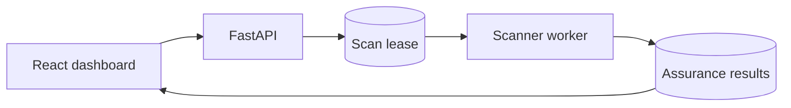

# ECDAT working memory

Updated: 2026-09-10

## Repository state

- Remote: `https://github.com/tishanbrijesh-rgb/ECDAT-SIH.git`
- Active branch: `fix/sha1-recommendation`
- Frontend improvements are intentional project work. Do not revert or overwrite
  them while changing backend, scanner, deployment or database code.
- The audited frontend, backend, scanner, migration, deployment and regression
  work is prepared as one verified release candidate.
- Phases 1–4 are complete; remaining items are production infrastructure projects.

## Verified baseline

- Backend: 118 tests pass; 1 skip and 84 subtests. Migration-test environment isolation fixes the
  former end-to-end scan timing failure.
- Migration tests: 8/8 pass (upgrade, downgrade, data preservation, graph).
- Frontend: 22 unit tests, 7 Chromium E2E tests, formatting, TypeScript and production
  build pass.
- Security: pip-audit and npm audit are clean; Bandit has no medium/high findings;
  no tracked secret signatures or large files were found.
- Large scan: `C:\Python314` processed 2,303 of 2,314 supported files in
  105,485 ms (99.52% coverage), producing 1,181 evidence records. Eleven files
  reported only safe relative paths and fixed failure categories.
- Docker/PostgreSQL: two final disposable verifier invocations passed 3/3 rounds
  each, including persistence after backend restart and cleanup.
- Dashboard container: Node 22 build stage, unprivileged nginx runtime, explicit
  health check, about 26 MB.
- Backend container: unprivileged UID/GID 10001, no compiler toolchain, about 77 MB.

## Phase 3 completion summary

- Alembic with 4 migrations: 0001_baseline, 0002_scan_failures,
  0003_remove_implicit_creation and 0004_scan_leases.
- Request-ID JSON logging, endpoint-aware rate limits, stale-job recovery,
  database leases and authenticated SSE progress are implemented.
- `ScanFailureDB` ORM model with FK cascade delete.
- `ScanJobResponse` schema coerces ORM objects via `ConfigDict(from_attributes=True)`
  and `field_validator(mode="before")`.
- Legacy `__failed_file__:` entries stripped by schema validators.
- `ECDAT_AUTO_CREATE_TABLES` env var guards production `create_all`.
- `docker-compose.yml` sets `ECDAT_AUTO_CREATE_TABLES: "false"`.

## Running the system

- Backend: `http://localhost:8000` (uvicorn)
- Dashboard: `http://localhost:3000` (Vite dev)
- Login: use the account configured in the untracked project-root `.env` file.
- API docs: `http://localhost:8000/docs`

## Operational constraints

- Never commit `.env`, credentials, token secrets, database files, virtual
  environments, `node_modules`, build output or Graphify output.
- Use random temporary credentials for verification and let
  `scripts.verify_compose` clean up its uniquely named Compose project.
- Database leases prevent duplicate claims, but a durable external queue and shared
  rate limiter remain production work.
- Treat subprocess isolation as reliability containment, not a complete security
  sandbox.
- Accuracy claims must name the evaluated corpus. The v2 and v3 corpora are consumed
  regression evidence and cannot be reused as new independent holdouts.
- Certificate deprecation warnings are converted to controlled failures; mixed
  bundles continue without leaking parser details.

## Latest detailed verification

See `docs/verification-2026-09-10.md` for the latest local verification and
`docs/stages-1-4-verification-2026-09-07.md` for its historical predecessor.

The execution sequence is documented in
`docs/release-improvement-plan-2026-09-07.md`. The scoped frontend and release
hardening work is complete.

## Next authorized boundary

Future work requires a new scope for SSO, TLS termination, managed secrets,
backup/restore, a durable external queue, shared throttling, or OS sandboxing.
