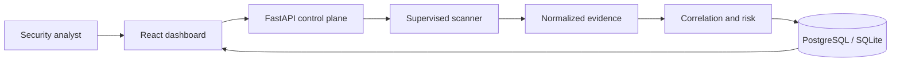

# ECDAT — Enterprise Cryptographic Discovery & Analysis Tool

ECDAT is the SIH26164 privacy-first cryptographic inventory and discovery-assurance prototype. It correlates explainable evidence from source structure, auditable multi-language rules, dependencies, and X.509 certificates; measures confidence and coverage separately; exposes conflicts and blind spots; and produces context-aware PQC migration priorities.



Documentation navigation: [docs/INDEX.md](docs/INDEX.md).

## Quick start

### Option A — Docker Compose (recommended)

```bash
docker compose up --build
```

Open **http://localhost:3000** and sign in with an account configured in the
untracked `.env` file.
API documentation at **http://localhost:8000/docs**.

### Option B — Local development (no Docker)

```powershell
# Terminal 1 — Backend
$env:DATABASE_URL="sqlite:///./ecdat_local.db"
.venv\Scripts\python.exe -m uvicorn backend.main:app --host 0.0.0.0 --port 8000

# Terminal 2 — Dashboard
cd dashboard
npx vite --host 0.0.0.0 --port 3000
```

Open **http://localhost:3000** and sign in with an account configured in `.env`.

The production dashboard serves API requests through the same origin under
`/api`. The bundled Nginx configuration forwards those requests to the backend
container, so a deployed browser does not depend on `localhost:8000`. Keep port
3000 behind a TLS-terminating reverse proxy for any shared or public deployment.

> **Note:** Credentials are defined in the untracked `.env` file or via
> `ECDAT_USERS_JSON`. See `LOGIN_CREDENTIALS.md` for details.

## Tests

After installing `requirements-dev.txt`, run the Python suite, frontend lint, and coverage:

```powershell
# Backend — unit tests with coverage
pytest --cov=backend --cov-report=term

# Frontend — lint, unit tests, build
cd dashboard
npm run lint
npm test
npm run build
```

### CI quality gates

| Gate | Command |
|---|---|
| Python lint (Ruff) | `ruff check backend/` |
| Backend coverage | `pytest --cov=backend --cov-report=xml` |
| Frontend lint (ESLint) | `npm run lint` (from `dashboard/`) |
| Frontend format check | `npm run format:check` |
| Frontend unit tests | `npm test` |
| Frontend build | `npm run build` |

The CI pipeline runs all gates on every push and pull request. Coverage must stay above 70%. See `.coveragerc` for configuration.

### Coverage configuration

Coverage is configured in `.coveragerc` at the project root:

- **Source**: `backend/` package
- **Branch coverage**: enabled
- **Minimum threshold**: 70%
- **Reports**: terminal (text) and XML (for CI artifacts)

### Python linting

Ruff configuration is in `ruff.toml` at the project root. Run `ruff check backend/` to lint. The initial rule set covers pycodestyle errors (E), Pyflakes (F), and flake8-bugbear (B). Line length is 100 characters.

On Windows, run the complete release gate:

```powershell
.\scripts\verify_release.ps1
```

### Test results

| Suite | Status |
|---|---|
| Backend (unit + API) | 118 pass, 1 skip; 84 subtests |
| Migration tests | 8/8 pass |
| Backend coverage | 84.95% |
| Frontend unit | 22 pass |
| Chromium E2E | 7/7 workflows pass |
| Security | No known vulns, no medium/high Bandit |
| Benchmark | 8 TP, 0 FP, 0 FN (deterministic) |

## SIH presentation pack

- [Architecture](docs/ARCHITECTURE.md)
- [Threat model](docs/THREAT_MODEL.md)
- [Five-minute demonstration](docs/DEMO_SCRIPT.md)
- [Readiness checklist](docs/SIH_READINESS.md)

The local demo accepts signed sessions from `POST /api/auth/login` using accounts
you provision in `ECDAT_USERS_JSON`. All data endpoints require authentication.
Role-header impersonation is disabled by default. Follow the
[authentication setup](docs/authentication.md) before starting the backend;
the FastAPI entrypoint loads the project-root `.env` for local development.

## Eight-layer architecture

1. **Collection** — repositories, source files, manifests, and certificates.
2. **Detection** — Python AST, independent JSON rules, dependency mapping, and X.509 parsing.
3. **Normalization** — a common cryptographic-asset and evidence model.
4. **Correlation** — file/operation/algorithm/usage identities and evidence relationships.
5. **Discovery Assurance** — confidence, measured coverage, operation conflicts, and blind spots.
6. **Risk** — quantum exposure, Mosca planning window, sensitivity, criticality, exposure, and migration effort.
7. **Recommendation** — usage-aware ML-KEM, ML-DSA, SLH-DSA, symmetric, or hybrid guidance.
8. **Presentation** — assurance dashboard, inventory, evidence detail, CBOM, reports, graph, evaluation, and APIs.

| Layer | Technology |
|---|---|
| Scanner | Python AST, auditable regex rules, `cryptography` |
| API | FastAPI and Pydantic |
| Persistence | SQLAlchemy, Alembic migrations, PostgreSQL 16 (SQLite for local) |
| Dashboard | React 18, TypeScript, Vite, Recharts |
| Runtime | Docker Compose |

## Discovery Assurance

- **Confidence** measures the strength and agreement of independent evidence for one finding.
- **Coverage** is measured from successfully scanned supported files, never inferred from confidence.
- **Conflicts** require incompatible algorithms in the same operation and category; a file legitimately using AES, RSA, and SHA is not a conflict.
- **Blind spots** state which enterprise surfaces remain outside the current static scan scope.

## Mosca-style risk model

The transparent 0–100 score combines quantum vulnerability, whether `data lifetime + migration time` overlaps the configured threat horizon, data sensitivity, business criticality, exposure, and migration effort. Every asset stores human-readable reasons behind its score. Recommendations depend on usage: key establishment, signature, TLS, hashing, or symmetric encryption.

## Outputs

| Endpoint | Purpose |
|---|---|
| `GET /api/dashboard/summary` | Latest assurance and risk posture |
| `GET /api/scans` | Scan history with safe failed-file categories |
| `GET /api/scans/{id}` | Scan metrics and sanitized relative failure paths |
| `GET /api/scans/{id}/events` | Authenticated server-sent progress events |
| `GET /api/assets` | Filterable cryptographic inventory |
| `GET /api/cbom` | CycloneDX-style cryptographic bill of materials |
| `GET /api/reports/risk` | JSON risk and migration roadmap |
| `GET /api/reports/risk.txt` | Downloadable judge-friendly risk report |
| `GET /api/evidence-graph` | Asset/evidence nodes and support edges |
| `GET /api/evaluation` | Precision, recall, F1, per-source metrics, and declared blind spots |
| `GET /api/audit-logs` | Append-only audit history for Auditor/Admin roles |

Signed sessions authorize requests; `admin` and `security_analyst` may scan or
edit risk context, while `auditor` and `viewer` are read-oriented roles. The
prototype performs local deterministic analysis and stores certificate/key
metadata—not private keys or source-code copies. Production deployments should
enable PostgreSQL volume encryption, TLS, secrets management, and
identity-provider authentication.

## Controlled evaluation dataset

`test-repo/ground_truth.json` defines expected assets. The dataset includes realistic Python and Java usage, RSA and ECDSA certificates, dependency-only TLS evidence, an intentional same-operation conflict, and runtime-generated crypto declared as a blind spot. The evaluation endpoint compares correlated output with this ground truth rather than inventing performance claims.

Add a test case by placing a supported `.py`, `.java`, `.js`, `.ts`, `.c`, `.cpp`, `.go`, `.cs`, `requirements.txt`, `pom.xml`, `.crt`, or `.pem` file below `test-repo/`, then update `ground_truth.json` with the expected component/algorithm pair.

## Verification

```bash
python -m compileall scanner backend scripts
python -m scanner.main test-repo
cd dashboard && npm run build
```
