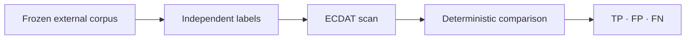

# External operation benchmarks

Reviewed: 2026-09-10



Run from the ECDAT-SIH root after installing `req.txt`:

```powershell
git clone --depth 1 --branch 2.2.0 https://github.com/pallets/itsdangerous.git .runtime/benchmarks/itsdangerous
git clone --depth 1 --branch rel/commons-codec-1.17.0 https://github.com/apache/commons-codec.git .runtime/benchmarks/commons-codec
git clone --filter=blob:none --no-checkout https://github.com/bcgit/bc-java.git .runtime/benchmarks/bc-java
git -C .runtime/benchmarks/bc-java checkout acd2178417ebc6be9df4a8b2582fc8cd2a041f9a
.\.venv\Scripts\python.exe -m scripts.benchmark_external --repeat 3
```

The manifest records immutable commit IDs, file SHA-256 checksums, and labels.
The runner verifies the selected file bytes before scanning. Upstream source is
not executed or redistributed here; clones remain ignored under `.runtime/`.
Do not clone over an existing checkout. If a tag moves, use the recorded commit.

The default v2 holdout contains eight complete selected files: 45 labelled
operations across three positive Java files and five negative Python/Java files.
It covers MD5, SHA-1, SHA-256 and SHA-512 API or named-wrapper call sites. Labels
were frozen before its first scanner run. Generic runtime-selected digests and
unsupported SHA-512 variants are outside its declared taxonomy.

V3 is a repository-independent post-fix holdout from the official Bouncy Castle
Java repository. Its seven pinned files contain eight direct digest labels and three
negative files covering constants, identifiers and runtime-selected algorithms.
The manifest was frozen before the scanner saw these files. Run it explicitly with
`--manifest benchmarks/external-v3.json`; it is not the default benchmark.

The earlier v1 sample is **two complete selected files**, not two complete repositories:
`itsdangerous/signer.py` (3 labelled operations) and Apache Commons Codec
`Md5Crypt.java` (12). The mixed case combines those same files; it is not an
independent third sample. Labels count static API/wrapper call sites, not runtime
iterations. Imports, declarations and constants are excluded. Hash update/finalize
calls belong to their initialized operation. Unknown HMAC digest choices stay unknown.

V1 labels were manually written before baseline scanning and later independently
reviewed. After its defects were fixed, v1 became regression data and is no longer
an untouched holdout. Run it with `--manifest benchmarks/external-v1.json`.

V2's 45 positive labels and five negative files were independently reviewed after
the baseline. All labels, hashes and revisions were confirmed. The reviewed baseline
is recorded in `docs/accuracy-benchmark-v2.md`. Because the scanner results have now
been viewed, v2 is a consumed holdout and later fixes must be reported as
benchmark-driven changes.

V3 is a repository-independent implementation holdout from the official Bouncy
Castle Java repository at one immutable commit. Its seven complete files contain eight
positive call-site labels and three negative files. The selection separates SHA-1
constructors and an underscore-form SHA-256 selector from constants, selector
comparisons, dynamic algorithm variables, and truncated SHA-512/224 and SHA-512/256
variants. Its labels and hashes were frozen and independently reviewed before any
ECDAT scanner run. V3 is now a consumed holdout; corrections require a new manifest
version and a written rationale.

Run the consumed v3 corpus as a regression check with:

```powershell
.\.venv\Scripts\python.exe -m scripts.benchmark_external --repeat 3 --manifest benchmarks/external-v3.json
```

Matching uses file, line and algorithm, with one-to-one occurrence matching so
duplicates count as false positives. Usage and key-size correctness are separate
metrics; a missed known key size remains in the denominator. There are no known
key sizes in this external sample, so its key-size accuracy is unavailable, not
100%. Synthetic regression fixtures cover explicit AES key sizes separately.

Next: freeze a new repository-independent corpus with positive key-size labels,
additional supported languages, mixed operations, aliases and wrappers before
using benchmark-driven scanner fixes as evidence of generalization.
