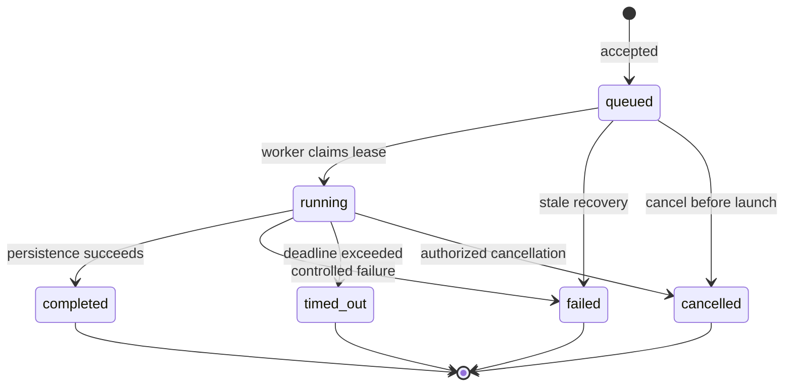

# ECDAT architecture

## System flow

```mermaid
flowchart LR
    U[Security analyst] --> UI[React assurance console]
    UI -->|Bearer API + SSE| API[FastAPI control plane]
    API -->|admit + lease| JOB[(Scan job)]
    JOB --> WORKER[Supervised child worker]
    WORKER --> COLLECT[AST · rules · dependencies · X.509]
    COLLECT --> CORR[Operation-aware correlation]
    CORR --> RISK[Confidence · coverage · PQC risk]
    RISK --> DB[(PostgreSQL / SQLite)]
    DB --> OUT[Inventory · CBOM · reports · evaluation]
    OUT --> UI
```

## Scan lifecycle

## Assurance principles

- Confidence describes evidence strength; coverage describes measured scan scope. They are never treated as the same metric.
- Dependency evidence represents capability and is not promoted over stronger usage evidence in the same component.
- A conflict requires incompatible algorithms in the same operation and category, not merely multiple algorithms in one file.
- Every risk score stores its contributing context and human-readable reasons.
- The scanner remains local to the deployment; the prototype does not transmit source code.

## Deployment modes

- **Judge/local mode:** SQLite, two local processes, bundled controlled repository.
- **Compose mode:** PostgreSQL 16, backend and dashboard containers, read-only scanner input volume.
- **Future production mode:** authenticated repository ingestion, durable external queue, hardened workers, secrets manager and organization SSO.
