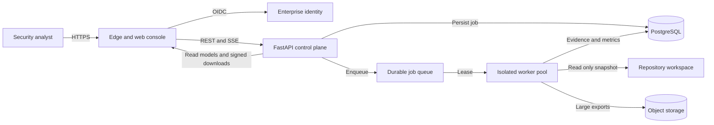
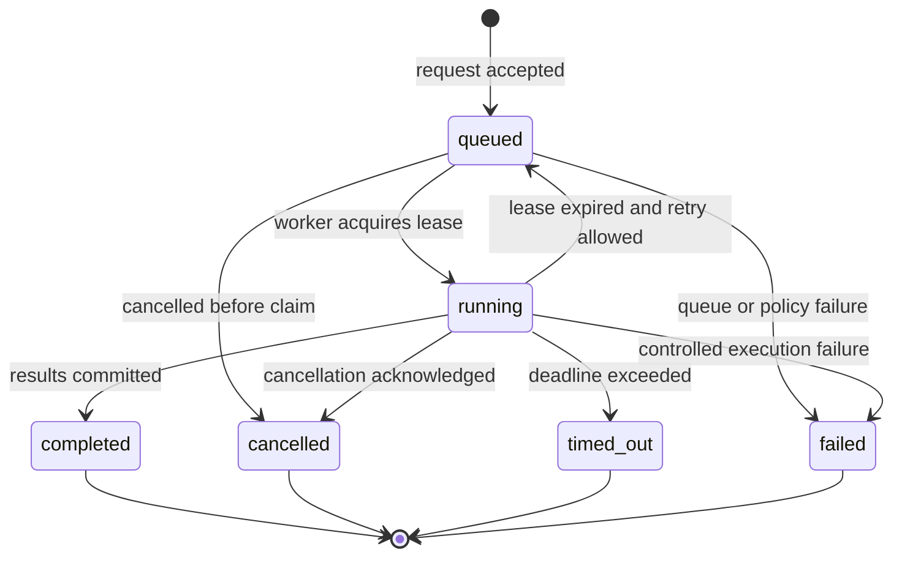

# ECDAT Complete Architecture and Build Guide

**Enterprise Cryptographic Discovery and Analysis Tool**  
**From first requirements to a production ready release**  
Version 1.0 | 13 September 2026

## Executive summary

ECDAT is a security assurance platform that discovers cryptographic usage in source repositories, explains the evidence behind each finding, measures scan coverage, ranks migration risk, and exports a Cryptographic Bill of Materials. A finished product should be built as a modular platform rather than as one large web service: a React web console presents results; a FastAPI control plane authenticates users and manages jobs; a durable queue schedules work; isolated scanner workers inspect read-only repository snapshots; PostgreSQL stores operational and evidence data; object storage retains large reports; and an observability layer records metrics, logs, traces, and audit events.

The existing `ECDAT-SIH` repository already proves the essential product loop with React, FastAPI, SQLAlchemy, SQLite or PostgreSQL, supervised child workers, AST and rule collectors, dependency and certificate analysis, evidence correlation, confidence scoring, risk scoring, SSE progress, RBAC, audit logs, migrations, CI, and benchmark corpora. The main production evolution is to separate the scanner from the API process, replace process-local scheduling with a durable queue, add enterprise SSO and tenant boundaries, harden repository ingestion, and operate the system with explicit service objectives.

The recommended delivery sequence is: define the evidence contract first; build a deterministic scanner CLI; establish the database and migrations; add the asynchronous control plane; expose stable APIs; build the analyst workflow; add security and observability; validate accuracy with labeled corpora; then release through staged environments. This order keeps the hardest product property - trustworthy evidence - at the center of the design.

## 1 Product purpose

### 1.1 Problem

Organizations usually cannot answer four basic questions reliably:

- Which cryptographic algorithms, libraries, certificates, protocols, and key operations exist across their codebase?
- Which findings represent real operations and which are only imports, declarations, metadata, or transitive capabilities?
- Which assets are exposed to post-quantum risk, and what should migrate first?
- How complete was a scan, what failed, and why should an analyst trust the result?

ECDAT answers these questions by producing evidence-backed, explainable inventory rather than a flat list of keyword matches.

### 1.2 Product outcomes

A complete release must let a security analyst:

1. Authenticate and select an authorized repository or source snapshot.
2. Start, observe, cancel, and review a scan.
3. See coverage, failures, and declared blind spots separately from confidence.
4. Inspect every asset from risk score down to source evidence and location.
5. distinguish confirmed operations from declared capability and artifact metadata.
6. Correct business context without overwriting machine evidence.
7. Export a CBOM, risk report, and audit-ready evidence record.
8. Compare scans over time and identify new, changed, or resolved findings.

### 1.3 Personas and roles

| Role | Primary need | Minimum permissions |
|---|---|---|
| Security analyst | Run scans, investigate findings, set business context | Create and cancel scans; read and update assets; export reports |
| Cryptography owner | Plan remediation and approve migration decisions | Read findings; update ownership and migration state; comment or attest |
| Auditor | Verify controls and evidence without changing results | Read scans, evidence, reports, and audit history |
| Platform administrator | Operate the service and control access | Manage integrations, policies, retention, users, and system health |
| Executive or program viewer | Understand exposure and progress | Read aggregate dashboards and approved reports |

## 2 Scope and boundaries

### 2.1 Version one scope

Version one should scan checked-out repositories or immutable source archives. It should support language-aware analysis for Python, Java, JavaScript and TypeScript, Go, C and C++, and C Sharp; dependency manifests and lockfiles; X.509 certificates; configuration files; and registry-driven fallback rules. It should detect common encryption, signature, hashing, message authentication, key derivation, key exchange, and transport security patterns.

The product should store normalized assets, the underlying evidence chain, confidence explanations, coverage statistics, structured scan failures, risk context, PQC recommendations, and audit events. The web console should expose dashboard, scan, inventory, asset detail, evidence graph, CBOM, risk report, calibration, and evaluation views.

### 2.2 Explicit non-goals for the first release

- Dynamic runtime tracing, packet inspection, HSM inventory, cloud key-management discovery, and binary reverse engineering.
- Automated cryptographic migration or source-code rewriting.
- Claiming that file coverage equals detection completeness.
- Treating a dependency declaration as proof that an algorithm is executed.
- Sending private source code to an external model or hosted analysis service.

These boundaries must be visible in the product, reports, and API. A security tool loses trust when it hides uncertainty.

## 3 Requirements

### 3.1 Functional requirements

| Area | Required capability | Acceptance signal |
|---|---|---|
| Identity | SSO or signed sessions with RBAC | Unauthorized actions return 401 or 403 and are audited |
| Repository intake | Validate path, archive, or provider reference against policy | Scanner receives only a read-only, bounded workspace |
| Job control | Queue, lease, cancel, timeout, retry, and stale-job recovery | Every job reaches one terminal state |
| Discovery | Run registered collectors over one shared inventory pass | Supported files are processed once and collector counts are recorded |
| Correlation | Merge evidence by logical asset and operation context | Duplicate evidence does not become duplicate assets |
| Confidence | Score evidence strength with human-readable reasons | Score and reasons are stored together |
| Coverage | Measure supported files processed and record failures | Coverage never substitutes for confidence |
| Risk | Combine technical exposure with business context | Score, label, reasons, and recommendation remain reproducible |
| Outputs | Dashboard, inventory, evidence graph, CBOM, risk report | Exports identify scan, schema version, and generation time |
| Audit | Record security-sensitive actions and retention events | Audit history is immutable to non-admin users |

### 3.2 Non-functional requirements

| Quality | Initial target | Production target |
|---|---:|---:|
| API availability | 99.5 percent monthly | 99.9 percent monthly |
| Interactive API latency | P95 below 500 ms | P95 below 300 ms |
| Scan start latency | Below 5 seconds | P95 below 30 seconds under normal queue load |
| Progress freshness | Within 2 seconds | Within 5 seconds across regions |
| Maximum source file | 8 MiB default | Policy controlled up to 128 MiB |
| Maximum repository inventory | 100000 files default | Tiered policy with backpressure |
| Evidence cap | 100000 records default | Tenant and job quota controlled |
| Recovery | No accepted job is silently lost | RPO below 5 minutes and RTO below 60 minutes |
| Accessibility | Keyboard operable, WCAG AA contrast | Automated and manual WCAG 2.2 AA verification |

## 4 Architecture principles

1. **Evidence before scoring.** Detection produces immutable evidence; correlation, confidence, and risk are derived stages.
2. **Confidence and coverage are different.** Confidence describes evidence strength. Coverage describes measured processing scope.
3. **Capability is not use.** Imports, packages, and certificates are weaker claims than observed call sites or operations.
4. **Source remains private.** Workers process read-only snapshots inside the deployment boundary; persisted evidence is redacted and minimal.
5. **Jobs are durable.** Accepting a scan creates persistent state before work begins.
6. **Workers are disposable.** A worker can crash or time out without corrupting control-plane state.
7. **Every decision is explainable.** Confidence and risk include versioned reasons and parameter provenance.
8. **Contracts are versioned.** Evidence, database, API, CBOM, and rule-registry schemas evolve explicitly.
9. **Secure defaults fail closed.** Missing auth, invalid paths, oversized inputs, and unknown roles do not silently degrade.
10. **Accuracy is a release gate.** Labeled corpora and holdout results are part of CI, not an occasional manual exercise.

## 5 Recommended production architecture



The primary trust boundary surrounds the API, database, queue, worker pool, repository workspace, and object storage. Only the edge tier is internet-facing. Repository credentials are exchanged for short-lived access and are never sent to the browser. Workers receive a job-specific identity, read-only input, strict CPU, memory, file-count, and wall-clock limits, and no general outbound network access.

### 5.1 Edge and web console

Use a CDN or reverse proxy to terminate TLS, apply secure headers, limit request size, and serve the compiled React application. The console uses REST for commands and queries, and SSE for scan progress. It stores only short-lived session state; durable filters and saved views should be stored server-side when added.

### 5.2 Identity and access

For local development, signed HMAC sessions and configured users are sufficient. Production should use OIDC with an enterprise identity provider, group-to-role mapping, multi-factor authentication, and short session lifetimes. The API, not the browser, remains the authorization authority.

### 5.3 FastAPI control plane

The control plane validates requests, authorizes actions, records audit events, persists jobs, creates repository snapshot requests, publishes queue messages, exposes progress, and renders read models. It must not perform long scans inside request handlers.

Split the application into routers, application services, domain policies, persistence adapters, integration adapters, and background maintenance tasks. Keep scanner-specific parsing out of the web layer.

### 5.4 Durable queue and scheduler

Use Redis Streams, RabbitMQ, SQS, or another durable queue. A queue message should contain a job identifier and snapshot reference, not source content. Workers claim a time-bound lease. A sweeper requeues expired claims only when the job is still eligible and the retry budget remains.

Queue semantics should be at-least-once. Therefore the worker persistence step must be idempotent: write results under a job-scoped transaction or version, then mark completion exactly once.

### 5.5 Isolated worker pool

Each worker should run in a container or sandbox with:

- a read-only repository volume or extracted immutable archive;
- a writable, job-specific temporary directory;
- no privileged mode or host filesystem access;
- CPU, memory, process, file-size, evidence-count, and duration limits;
- restricted egress and a minimal runtime image;
- a worker identity authorized only for its job;
- cancellation checks between files and collector stages.

### 5.6 PostgreSQL

PostgreSQL is the system of record for users or identity mappings, repositories, snapshots, scan jobs, leases, failures, assets, evidence, risk context, exports, and audit events. Use Alembic migrations, transactional writes, connection pooling, encrypted storage, point-in-time recovery, and row-level tenant constraints if the service becomes multi-tenant.

### 5.7 Object storage

Store large CBOM files, reports, retained source archives when policy permits, and debug bundles in object storage. Use content hashes, server-side encryption, retention rules, and short-lived signed download URLs. Never expose an arbitrary filesystem path through an API response.

### 5.8 Observability

All services should emit structured logs with request ID, job ID, tenant ID, and worker ID. Metrics should cover API latency, error rate, queue depth, job age, scan duration, throughput, coverage, failure categories, evidence counts, and worker resource use. Distributed traces should connect request acceptance, queue publication, worker execution, persistence, and export generation.

## 6 End to end scan lifecycle



### 6.1 Request acceptance

1. Authenticate the caller and authorize scan creation.
2. Validate repository identity, requested revision, profile, and scan options.
3. Resolve the request to an immutable commit SHA or archive hash.
4. Create a `scan_jobs` row with `queued` status and a unique idempotency key.
5. Record an audit event.
6. Publish the job identifier to the queue.
7. Return `202 Accepted` with the scan identifier and progress URL.

If queue publication fails, the transaction or outbox record must preserve enough state for safe redelivery.

### 6.2 Worker claim

The worker reads a queue message, atomically acquires a lease, changes the job to `running`, and records its worker ID and deadline. A competing worker must fail to claim the same active job. Heartbeats extend the lease only while the worker is healthy and within the configured maximum duration.

### 6.3 Repository preparation

The repository adapter creates an isolated workspace at the exact requested revision. It rejects links and junctions that escape the root, normalizes paths, enforces archive expansion limits, removes credentials after checkout, and mounts the result read-only for the scanner.

### 6.4 Inventory

Walk the repository once. Exclude generated and vendored directories according to the selected `source` or `environment` profile. Record all files, supported files, inaccessible files, linked files, oversized files, and unsupported categories. The inventory becomes the denominator for coverage.

### 6.5 Collection

The collector registry chooses handlers by filename and extension. Each supported file may be inspected by one or more collectors:

| Collector | Strongest signal | Typical output |
|---|---|---|
| AST collector | Language-aware call site or operation | Algorithm, operation, arguments, span, parser version |
| Rule collector | Registry pattern with surrounding context | Candidate algorithm, category, matched expression, location |
| Dependency collector | Declared package or lockfile dependency | Library capability, version, manifest path |
| Certificate collector | Parsed X.509 structure | Signature algorithm, public-key algorithm, key size, validity metadata |

Collectors return evidence records; they do not directly decide business risk. Every record includes algorithm, category, location, source, evidence kind, parser version, span, redacted evidence, and collector-local confidence signals.

### 6.6 Correlation

Correlation converts individual evidence records into logical cryptographic assets. Use operation anchors such as component, symbol, call site, protocol role, or certificate identity. Merge supporting evidence for the same operation. Keep incompatible operations separate. Mark a conflict only when incompatible algorithms occur in the same operation and category, not merely in the same file.

Dependency-only evidence can support a confirmed source finding but must not replace it or raise it above stronger operation evidence. The correlator version is part of result provenance.

### 6.7 Confidence

Confidence represents the strength of the claim that an asset or operation exists. A practical model starts from evidence kind and adjusts for independent corroboration, parser precision, argument extraction, ambiguity, and conflict. Store both the score and an ordered list of reason objects.

Calibrate confidence against labeled outcomes. Track reliability by score bucket and collector. A score of 0.8 should mean approximately 80 percent of comparable findings are correct; otherwise the label is decorative rather than trustworthy.

### 6.8 Coverage and failures

Coverage is computed as successfully processed supported files divided by supported files in scope. It must include total files, in-scope files, scanned files, failed files, collector statistics, duration, and structured failures. A result with no supported files should say coverage is not established rather than implying success.

### 6.9 Risk scoring

Risk combines technical and business context. The persisted calculation should include:

- algorithm and key strength;
- quantum vulnerability and cryptographic category;
- confirmed use versus capability only;
- exposure and protocol role;
- business criticality and data sensitivity;
- data lifetime, migration time, and threat horizon;
- migration effort, hybrid recommendation, and policy overrides.

The output is a numeric priority score, label, reasons, PQC candidate, recommendation, and versioned parameter provenance. Updating business context recomputes risk without altering evidence.

### 6.10 Commit and completion

Write assets, evidence, failures, metrics, and export metadata in a job-scoped transaction or staging version. Only after validation succeeds should the job become `completed`. Publish a terminal progress event, release the lease, and schedule temporary workspace deletion.

## 7 Evidence contract

The evidence contract is the foundation of the product. Define it before writing collectors.

```json
{
  "schema_version": "1.0",
  "algorithm": "AES-256-GCM",
  "category": "encryption",
  "location": "src/crypto/service.py",
  "source": "ast",
  "evidence_kind": "observed_operation",
  "operation": "encrypt",
  "component": "payments-api",
  "span": { "start_line": 42, "end_line": 47 },
  "parser_version": "python-ast-3",
  "evidence": { "callee": "AESGCM.encrypt", "key_size": 256 },
  "confidence": 0.94,
  "confidence_reasons": [
    { "code": "LANGUAGE_AWARE_CALL", "delta": 0.25 }
  ]
}
```

Required rules:

- Repository paths are relative and normalized; absolute host paths are never returned.
- Source snippets are minimized and redacted before persistence.
- Evidence kind is one of `observed_operation`, `declared_capability`, `configured_protocol`, `artifact_metadata`, or `unknown`.
- Parser, rule-registry, correlator, confidence-model, and risk-model versions are retained.
- Unknown values stay unknown; they are not filled with optimistic defaults.

## 8 Data architecture

### 8.1 Core relational model

| Entity | Purpose | Important fields and indexes |
|---|---|---|
| organizations | Tenant boundary for a hosted service | id, name, status, retention policy |
| identity_mappings | External subject and role mapping | organization_id, issuer, subject, role |
| repositories | Authorized source and ownership metadata | organization_id, provider, external_id, default branch |
| repository_snapshots | Immutable scan input | repository_id, commit_sha, content_hash, object_ref |
| scan_jobs | Lifecycle and measured scan result | status, timestamps, coverage, counts, duration, version set |
| scan_leases | Exclusive worker claim | scan_job_id unique, worker_id, acquired_at, expires_at, released |
| scan_failures | Structured per-file or stage failure | scan_job_id, relative path, reason code, stage |
| crypto_assets | Correlated logical finding | scan_job_id, logical_asset_id, algorithm, location, confidence, risk |
| evidence_records | Immutable evidence items | asset_id, source, kind, span, payload, parser version |
| asset_context | Analyst-owned business context | asset_id, owner, criticality, sensitivity, exposure, migration state |
| exports | Generated artifact metadata | scan_job_id, type, schema version, object ref, hash |
| audit_events | Append-only security and change history | actor, action, resource, timestamp, details hash |

The current implementation keeps evidence JSON and context on `crypto_assets`, which is appropriate for a prototype. Production should normalize high-volume evidence into `evidence_records` and separate analyst-owned context so rescans do not erase human decisions.

### 8.2 Data retention

Define separate retention periods for source snapshots, raw evidence, normalized findings, exports, operational logs, and audit events. Source snapshots should have the shortest default retention. Audit records should be append-only and retained according to organizational policy. Deletion jobs must be observable, idempotent, and auditable.

### 8.3 Schema evolution

All schema changes go through Alembic. Deploy additive database changes before application code that requires them. Use expand and contract migrations for zero-downtime changes. Store result schema versions so historical scans remain readable after scoring logic evolves.

## 9 API architecture

### 9.1 API conventions

- Prefix stable endpoints with `/api/v1`; keep the current `/api` routes as a compatibility layer during migration.
- Use JSON problem details for errors with code, message, request ID, and safe field details.
- Require idempotency keys for scan creation and export generation.
- Use cursor pagination for large asset and audit collections.
- Apply authorization at the resource query as well as the route.
- Generate and validate OpenAPI in CI; generate frontend types from the contract.
- Return relative evidence locations and signed URLs for stored artifacts.

### 9.2 Recommended endpoint surface

| Method | Endpoint | Purpose |
|---|---|---|
| POST | `/api/v1/auth/session` | Local-only session exchange or OIDC callback support |
| GET | `/api/v1/me` | Identity, role, organization, and permissions |
| POST | `/api/v1/scans` | Validate and queue a scan |
| GET | `/api/v1/scans` | List authorized scans with cursor pagination |
| GET | `/api/v1/scans/{scan_id}` | Scan state, metrics, failures, and links |
| POST | `/api/v1/scans/{scan_id}/cancel` | Request cancellation |
| GET | `/api/v1/scans/{scan_id}/events` | SSE progress and terminal events |
| GET | `/api/v1/assets` | Filtered and paginated inventory |
| GET | `/api/v1/assets/{asset_id}` | Asset, context, evidence, and provenance |
| PATCH | `/api/v1/assets/{asset_id}/context` | Update analyst-owned business context |
| GET | `/api/v1/scans/{scan_id}/evidence-graph` | Logical asset and evidence graph |
| POST | `/api/v1/scans/{scan_id}/exports` | Generate CBOM or risk report |
| GET | `/api/v1/exports/{export_id}` | Export state and signed download link |
| GET | `/api/v1/dashboard/summary` | Aggregate risk and coverage read model |
| GET | `/api/v1/audit-events` | Authorized audit history |
| GET | `/health/live` | Process liveness only |
| GET | `/health/ready` | Database, queue, migration, and dependency readiness |

### 9.3 Progress event schema

SSE events should be monotonic and resumable. Include event ID, job ID, state, stage, files processed, files total, evidence count, percentage, timestamp, and an optional safe message. Support `Last-Event-ID` or allow the client to recover by fetching the current job state.

## 10 Frontend architecture

### 10.1 Application structure

Use React and TypeScript with route-level pages, a typed API client, query caching, accessible shared components, and centralized session handling. A scalable source layout is:

```text
dashboard/src/
  app/              router, providers, error boundary, session
  api/              generated contracts, client, SSE transport
  features/
    auth/
    scans/
    assets/
    evidence/
    reports/
    dashboard/
  components/       reusable primitives and data visualizations
  styles/           design tokens, themes, primitives, responsive rules
  utils/            formatting, validation, and hooks
  test/             fixtures and test setup
```

The existing dashboard already implements login, dashboard, new scan, scan detail, assets, asset detail, risk report, CBOM, and evidence graph experiences. Refactoring by feature should happen only when the shared page directory becomes hard to navigate; avoid reorganizing stable code for appearance alone.

### 10.2 State strategy

Keep server state in a query cache and local interaction state in components or focused stores. Session expiry, selected organization, and global notifications belong in application providers. Do not mirror API collections into a second mutable global store.

### 10.3 Analyst workflow

The main navigation should follow the investigation path:

1. Dashboard shows posture, last scan, risk distribution, confidence, and coverage.
2. New scan validates source, profile, and limits before submission.
3. Scan detail shows live stage progress, measured scope, failures, and blind spots.
4. Inventory supports filtering by risk, algorithm, category, evidence kind, source, and quantum exposure.
5. Asset detail presents the decision chain: summary, risk reasons, evidence, provenance, business context, and history.
6. Reports provide CBOM, risk priorities, and export status.

### 10.4 Accessibility and resilience

All interactions must work by keyboard, expose visible focus, meet AA contrast, and announce asynchronous state changes. Tables need real headers and responsive alternatives. Charts need text summaries. Error boundaries should preserve navigation and provide a retry path. Honor reduced-motion preferences and verify major flows with axe-core and manual screen-reader checks.

## 11 Security architecture

### 11.1 Trust zones

| Zone | Components | Primary controls |
|---|---|---|
| Public edge | CDN, reverse proxy, static web assets | TLS, WAF, rate limits, CSP, secure headers |
| Control plane | API, identity adapter, scheduler | OIDC, RBAC, request validation, audit, quotas |
| Execution plane | queue, workers, temporary workspaces | workload identity, sandboxing, no privilege, restricted egress |
| Data plane | PostgreSQL, object storage, backups | encryption, private network, scoped credentials, retention |
| Operations plane | logs, metrics, traces, alerting | restricted access, redaction, tamper resistance |

### 11.2 Repository threat controls

Treat every repository as hostile input. Protect against path traversal, archive bombs, symlink and junction escape, oversized files, parser denial of service, secret leakage, malicious filenames, deeply nested trees, unexpected encodings, and generated dependency trees. Do not execute repository code, build scripts, package hooks, macros, or tests during static discovery.

### 11.3 Application controls

- Validate all inputs with strict schemas and explicit bounds.
- Keep CORS origins allowlisted; never combine wildcard origins with credentials.
- Hash or encrypt sensitive tokens and rotate signing keys.
- Rate-limit login, scan creation, export creation, and expensive filters independently.
- Record authentication failures, scan creation, cancellation, context changes, exports, retention, and administrative access.
- Redact secrets and source fragments from logs and error responses.
- Generate an SBOM, scan dependencies and images, sign release artifacts, and verify signatures at deployment.

### 11.4 Role matrix

| Action | Admin | Analyst | Auditor | Viewer |
|---|:---:|:---:|:---:|:---:|
| View dashboard and scans | Yes | Yes | Yes | Yes |
| Create or cancel scan | Yes | Yes | No | No |
| Update asset context | Yes | Yes | No | No |
| Export approved reports | Yes | Yes | Yes | Optional |
| View audit history | Yes | Optional | Yes | No |
| Purge retained audit data | Yes | No | No | No |
| Manage integrations and policy | Yes | No | No | No |

## 12 Reliability and performance

### 12.1 Failure model

Differentiate user validation errors, repository acquisition failures, inventory failures, per-file parse failures, resource-limit failures, persistence failures, and infrastructure failures. Per-file errors normally produce a completed scan with reduced coverage; systemic errors produce a failed or timed-out job.

### 12.2 Idempotency and consistency

Use a client idempotency key plus normalized repository, revision, and option hash for scan creation. Use an outbox table to publish accepted jobs reliably. Workers write into job-scoped staging records and promote them atomically. Duplicate queue delivery must not duplicate assets or exports.

### 12.3 Backpressure

Enforce quotas at intake, queue, worker, and storage layers. The scheduler should consider tenant concurrency, repository size, job age, and priority. Return an estimated queue state without promising an exact completion time.

### 12.4 Caching

Cache only deterministic, versioned work. Candidate examples are repository content hashes, parsed file results keyed by content plus parser version, and generated exports keyed by scan plus schema version. Never reuse a cached risk result when analyst context or the risk-model version differs.

## 13 Deployment model

### 13.1 Local development

- React Vite development server on port 3000.
- FastAPI on port 8000.
- SQLite for the shortest setup, or local PostgreSQL for migration testing.
- In-process or supervised child worker for convenience.
- Controlled local repository roots only.

### 13.2 Integration with Docker Compose

Use PostgreSQL 16, a migration job, one API service, one or more worker services, a queue service, and the dashboard reverse proxy. Mount scan inputs read-only. Bind development ports to loopback. Store secrets in an ignored `.env` file only for local use.

### 13.3 Production Kubernetes or equivalent

- Edge ingress and static dashboard deployment.
- API deployment with multiple stateless replicas.
- Worker deployments separated by scan profile or resource class.
- Managed PostgreSQL, managed queue, and managed object storage.
- Network policies separating edge, control, execution, and data planes.
- Workload identity and external secret management.
- Horizontal autoscaling based on API latency and queue age, not CPU alone.
- Pod disruption budgets, topology spread, encrypted backups, and tested restore procedures.

### 13.4 Configuration

Configuration should be validated once at startup. Group settings under database, identity, CORS, repository policy, queue, worker limits, scoring versions, retention, logging, and observability. Fail readiness when required configuration or the expected migration revision is missing.

## 14 Repository structure from scratch

```text
ecdat/
  README.md
  LICENSE
  .env.example
  docker-compose.yml
  pyproject.toml
  package.json
  docs/
    architecture/
    api/
    security/
    operations/
    decisions/
  backend/
    main.py
    api/
    application/
    domain/
    persistence/
    integrations/
    middleware/
    models/
    schemas/
    migrations/
  scanner/
    cli.py
    inventory/
    collectors/
    correlation/
    scoring/
    registry/
    models/
    redaction/
  worker/
    main.py
    leasing.py
    executor.py
    cleanup.py
  dashboard/
    src/
    e2e/
  contracts/
    evidence.schema.json
    events.schema.json
    cbom.schema.json
  corpora/
    train/
    holdout/
    regression/
  tests/
    unit/
    integration/
    contract/
    security/
    performance/
  scripts/
  deploy/
    compose/
    kubernetes/
  .github/workflows/
```

Keep domain logic importable without FastAPI, SQLAlchemy, or React. This makes scanner and scoring tests fast and prevents framework concerns from becoming the architecture.

## 15 Build plan from zero

### Phase 0 Product framing and threat model

**Goal:** agree on claims before writing code.

- Define personas, supported inputs, evidence kinds, risk outputs, and non-goals.
- Write the threat model and data classification.
- Choose initial languages and algorithms based on target organizations.
- Define success metrics: precision, recall, calibration, coverage, scan time, and analyst task completion.
- Create architecture decision records for repository privacy, static-only scope, database, queue, and authentication.

**Exit criteria:** approved product brief, evidence schema, threat model, and architecture decisions.

### Phase 1 Scanner kernel

**Goal:** a deterministic CLI produces schema-valid evidence from a controlled repository.

- Implement bounded inventory traversal and path safety.
- Implement the collector registry and one high-precision collector.
- Add redaction and relative-path normalization.
- Produce JSON evidence plus coverage and failure metrics.
- Build positive, negative, alias, wrapper, and boundary fixtures.

**Exit criteria:** repeatable output, no repository code execution, schema validation, and a labeled baseline.

### Phase 2 Multi-source discovery

**Goal:** useful breadth without collapsing evidence semantics.

- Add language-aware AST collectors.
- Add rule, dependency, lockfile, and certificate collectors.
- Version every parser and rule pack.
- Add file, evidence, memory, and duration limits.
- Expand corpora for each supported language and algorithm.

**Exit criteria:** per-source metrics, deterministic collector selection, and documented blind spots.

### Phase 3 Correlation confidence and risk

**Goal:** convert raw evidence into explainable prioritized assets.

- Define logical asset identity and operation anchors.
- Merge corroborating evidence and preserve conflicting evidence.
- Build confidence reasons and calibration evaluation.
- Implement risk context, scoring, labels, and PQC mapping.
- Store model parameters and versions with each result.

**Exit criteria:** golden correlation tests, reproducible risk scores, and holdout calibration report.

### Phase 4 Persistence and asynchronous jobs

**Goal:** scans survive API and worker restarts.

- Create PostgreSQL schema and Alembic baseline.
- Implement job state machine, leases, cancellation, timeout, and stale recovery.
- Add durable queue, transactional outbox, worker heartbeat, and idempotent result commit.
- Add cleanup for workspaces, expired exports, and stale jobs.

**Exit criteria:** crash-recovery tests and no duplicate results under repeated delivery.

### Phase 5 API control plane

**Goal:** a versioned, authorized API exposes the complete workflow.

- Implement identity, RBAC, repository policies, scan commands, inventory queries, asset context updates, progress events, exports, and audit queries.
- Add request IDs, structured errors, pagination, rate limits, and timeouts.
- Publish OpenAPI and generate TypeScript types.

**Exit criteria:** contract tests, authorization matrix tests, and API performance budget.

### Phase 6 Analyst console

**Goal:** an analyst can complete the investigation without a CLI.

- Establish tokens, responsive shell, session flow, and navigation.
- Build dashboard, new scan, scan progress, inventory, asset detail, evidence graph, risk report, and CBOM pages.
- Add empty, loading, partial, failure, cancellation, and expired-session states.
- Add CSV or JSON download only where server exports are unnecessary.

**Exit criteria:** critical-path E2E tests, WCAG AA checks, and responsive review.

### Phase 7 Security and operational hardening

**Goal:** safely process hostile repositories.

- Isolate workers and restrict egress.
- Add OIDC, workload identity, secrets manager, encryption, retention, and backup restore.
- Add dependency, container, secret, and static security scanning.
- Perform parser fuzzing and adversarial archive tests.

**Exit criteria:** threat-model controls verified and high-severity findings resolved or explicitly accepted.

### Phase 8 Observability and production readiness

**Goal:** operators can detect and recover from failure.

- Implement service-level indicators, dashboards, alerts, trace propagation, and runbooks.
- Load test APIs and representative repositories.
- Run disaster recovery, worker crash, queue outage, and database failover exercises.
- Complete privacy, retention, accessibility, and support documentation.

**Exit criteria:** readiness review, rollback rehearsal, and on-call acceptance.

### Phase 9 Controlled release

**Goal:** prove the product with real users and bounded risk.

- Dogfood on known repositories with owner consent.
- Run a pilot with shadow comparison against manual inventories.
- Triage false positives and false negatives without tuning on the holdout set.
- Release progressively by organization and repository class.

**Exit criteria:** agreed accuracy, stability, support load, and adoption thresholds.

## 16 Testing and accuracy program

### 16.1 Test pyramid

| Layer | What it proves | Examples |
|---|---|---|
| Unit | Deterministic domain behavior | path normalization, evidence kind, scoring arithmetic, role checks |
| Golden fixture | Detector precision on exact files | positive and negative language examples, aliases, wrappers |
| Property and fuzz | Safety under unusual input | parsers, archive extraction, filenames, deeply nested syntax |
| Integration | Database, queue, worker, and API contracts | migrations, leasing races, cancellation, idempotent commit |
| Contract | Stable external schemas | OpenAPI, evidence JSON Schema, CBOM, progress events |
| End to end | Real analyst workflows | sign in, scan, observe, filter, inspect, export |
| Performance | Budgets under representative size | large directory, high evidence count, queue saturation |
| Security | Abuse resistance and isolation | traversal, symlink escape, unauthorized resources, secret redaction |
| Accessibility | Inclusive interaction | axe-core, keyboard, focus order, chart summaries |

### 16.2 Accuracy governance

Maintain training, holdout, and regression sets separately. Never tune thresholds on the holdout set. Report micro and macro precision, recall, and F1; per-language and per-collector results; confidence calibration; corpus composition; and known blind spots. A release fails when a protected regression case breaks or a defined metric falls below its threshold.

### 16.3 Reproducibility

Every benchmark result should record commit SHA, corpus manifest hash, parser and registry versions, configuration, runtime, operating system, and seed. Store the report as a CI artifact and retain meaningful baselines.

## 17 Continuous integration and delivery

### 17.1 Pull request pipeline

1. Format and lint Python, TypeScript, CSS, and configuration.
2. Type-check backend domain code and frontend contracts.
3. Run unit, detector, API contract, migration, and frontend tests.
4. Validate evidence, event, database, and CBOM schemas.
5. Run security scans and secret detection.
6. Build backend, worker, and dashboard images.
7. Generate SBOMs and sign build provenance.
8. Run a small end-to-end scan in an ephemeral environment.

### 17.2 Main branch and release pipeline

- Publish immutable images tagged by commit SHA.
- Deploy automatically to development and run smoke tests.
- Promote the same artifacts to staging after integration tests.
- Require approval and readiness evidence for production.
- Run migrations as a distinct pre-deploy job.
- Use canary or blue-green rollout for API and workers.
- Roll back application images independently from additive schema changes.

### 17.3 Scheduled quality jobs

Run the full corpus, accuracy regression, calibration analysis, dependency update verification, container scan, and restore test on a schedule. Trend results rather than treating each run as an isolated pass or fail.

## 18 Operations

### 18.1 Service level indicators

- Successful authorized API requests and latency by route.
- Queue age, queue depth, claim latency, and retry rate.
- Scan terminal-state distribution and duration by repository size.
- Coverage and structured failure rate by collector and language.
- Worker crashes, timeouts, memory pressure, and cleanup failures.
- Database saturation, replication lag, backup age, and migration revision.
- Export success rate and signed-download errors.

### 18.2 Alerts

Alert on user impact or imminent exhaustion: sustained API error rate, old queued jobs, falling completion rate, repeated lease expiry, abnormal timeouts, database connection exhaustion, failed backups, storage retention failure, or evidence volume anomalies. Do not page on every single scan failure; make per-job failures visible to the user and aggregate systemic patterns for operators.

### 18.3 Runbooks

Write runbooks for queue backlog, worker crash loop, stuck lease, database unavailability, bad migration, object-store failure, identity-provider outage, suspected secret leakage, corrupted export, and emergency retention suspension. Each runbook should include detection, impact, safe diagnosis, mitigation, rollback, data-integrity checks, and communication owner.

## 19 Scaling path

Scale in this order:

1. Measure file throughput and evidence volume by repository class.
2. Move scanning out of the API process.
3. Add queue-based backpressure and worker concurrency controls.
4. Cache deterministic file analysis by content and parser version.
5. Partition workers by language or resource profile only when measurement supports it.
6. Add read replicas or analytical storage only after dashboard queries compete with writes.
7. Add regional execution when repository residency or latency requires it.

Avoid premature microservices. The natural hard boundary is between control plane and untrusted scan execution. Correlation, confidence, and risk can remain modules inside the worker until independent scaling or ownership makes separation valuable.

## 20 Current implementation and production delta

| Concern | Current `ECDAT-SIH` implementation | Production recommendation |
|---|---|---|
| Web console | React, Vite, TypeScript, responsive design tokens, unit and E2E coverage | Keep stack; generate API types and add server-state query caching |
| API | FastAPI routers for auth, scans, assets, dashboard, outputs, audit, health, calibration, and metrics | Version endpoints and separate application services from persistence adapters |
| Authentication | Configured users with signed one-hour HMAC sessions; optional role header for tests | Enterprise OIDC, group mapping, MFA, and centralized policy |
| Scheduling | Process-local scan controller and supervised child process | Durable queue, separate worker deployment, outbox, distributed leases |
| Persistence | SQLAlchemy with SQLite or PostgreSQL and six Alembic revisions | PostgreSQL-only production, normalized evidence, tenant scope, PITR |
| Scanner | Shared inventory with AST, rule, dependency, and certificate collectors | Keep design; add more parsers, fuzzing, sandboxing, and content cache |
| Correlation | Versioned operation-aware correlation, including v3 implementation | Promote version selection into an explicit result contract and migration policy |
| Confidence | Explainable score and calibration data | Expand labeled data and monitor calibration drift |
| Risk | PQC-aware scoring with context provenance | Policy packs, approval workflow, and scoring-version comparison |
| Progress | SSE and stored job state | Durable event stream or resumable event log |
| Observability | Structured logging, scan metrics, optional Prometheus endpoint | Central logs, traces, SLO dashboards, and alert routing |
| Deployment | Local development and Compose with PostgreSQL and migration job | Managed data services and isolated autoscaled workers |

## 21 Delivery timeline and team

For a focused team of six to eight people, a credible first production pilot is approximately sixteen weeks. Accuracy work continues after launch.

| Weeks | Milestone | Primary owners |
|---:|---|---|
| 1 to 2 | Product brief, threat model, contracts, corpus plan | Product, security architect, scanner lead |
| 3 to 5 | Scanner kernel, registry, initial language collectors | Scanner engineers |
| 6 to 7 | Correlation, confidence, risk, baseline evaluation | Scanner and data engineers |
| 8 to 9 | PostgreSQL, queue, worker lifecycle, migrations | Backend and platform engineers |
| 10 to 11 | Versioned API, auth, progress, exports | Backend engineers |
| 10 to 12 | Analyst console and accessibility | Frontend engineers |
| 13 to 14 | Security hardening, observability, load tests | Platform and security engineers |
| 15 | Pilot, false-positive triage, runbooks, restore drill | Whole team |
| 16 | Readiness review and controlled release | Product, security, operations |

Minimum ownership should include product and security architecture, scanner and detection engineering, backend and data, frontend, platform or SRE, and quality or security testing. One person may cover more than one role in an SIH or prototype team, but the responsibilities must still be explicit.

## 22 Definition of done

A production pilot is done only when all of the following are true:

- A repository can be authorized, pinned to an immutable revision, scanned, cancelled, retried, and reviewed.
- Every accepted job has durable state and exactly one visible terminal outcome.
- No repository code executes during static analysis.
- Evidence paths are relative; persisted payloads and logs are redacted.
- Confidence, coverage, failures, risk reasons, and version provenance are visible and exportable.
- RBAC is enforced in the API and verified by tests.
- Database migrations work from an empty database and from the prior release.
- Duplicate messages, worker crashes, timeouts, and cancellation do not corrupt results.
- Accuracy thresholds pass on regression and untouched holdout corpora.
- Critical workflows pass unit, integration, E2E, accessibility, security, and performance gates.
- Backups restore successfully and the rollback procedure has been rehearsed.
- Operators have dashboards, alerts, runbooks, and named ownership.
- Privacy, retention, dependency, license, and release documentation is complete.

## 23 Launch checklist

### Product and evidence

- [ ] Scope, non-goals, supported languages, and blind spots are visible.
- [ ] Evidence and scoring schemas have explicit versions.
- [ ] Risk recommendations have security-owner approval.
- [ ] CBOM and reports identify their source scan and generation version.

### Security

- [ ] OIDC, RBAC, and least-privilege service identities are enabled.
- [ ] Worker sandbox and egress restrictions are verified.
- [ ] Secret, dependency, image, and configuration scans pass.
- [ ] Retention and incident-response procedures are approved.

### Reliability

- [ ] Queue retry, stale lease, cancellation, timeout, and idempotency tests pass.
- [ ] Load, soak, recovery, and database restore tests pass.
- [ ] SLOs, alerts, and on-call routes are active.

### Delivery

- [ ] Images are immutable, signed, and linked to SBOM and source commit.
- [ ] Migrations are compatible with the rollout and rollback plan.
- [ ] Production configuration is validated and secrets are externally managed.
- [ ] Pilot scope, support owner, and rollback decision maker are named.

## 24 Recommended first actions

1. Freeze and publish evidence schema version 1.0 from the current scanner model.
2. Write an architecture decision record for moving scan execution into a durable worker service.
3. Add `organizations`, `repositories`, `repository_snapshots`, `evidence_records`, and `exports` to the target data model.
4. Introduce an outbox-backed queue while preserving the existing scan API contract.
5. Generate frontend types from OpenAPI and add cursor pagination before inventory volume grows.
6. Establish protected holdout thresholds by language, collector, and evidence kind.
7. Run a controlled pilot and use analyst feedback to improve explanations before expanding detector breadth.

## 25 Glossary

| Term | Meaning |
|---|---|
| Asset | A correlated logical cryptographic operation, capability, protocol, or artifact |
| Evidence | A collector-produced observation supporting an asset claim |
| Evidence kind | Semantic strength of a claim, such as observed operation or declared capability |
| Confidence | Calibrated estimate of evidence correctness or strength |
| Coverage | Measured proportion of supported files processed without reported failure |
| CBOM | Cryptographic Bill of Materials describing discovered cryptographic components |
| PQC | Post-quantum cryptography |
| Operation anchor | Context used to decide whether evidence records belong to the same logical operation |
| Lease | Time-bound exclusive claim that lets one worker execute a job |
| Control plane | API and scheduling services that manage users, policy, and jobs |
| Execution plane | Isolated workers and workspaces that process untrusted repositories |

## Conclusion

The correct architecture for ECDAT is a trustworthy evidence pipeline wrapped in a durable, secure job platform. The web console and risk dashboards matter, but they are downstream of the core contract: bounded repository processing, explicit evidence semantics, operation-aware correlation, calibrated confidence, measured coverage, reproducible risk, and visible uncertainty. Build and test those properties first, then scale the control plane and worker fleet around them. The existing SIH implementation is a strong proof of this design; the production path is primarily an evolution in isolation, durability, identity, tenancy, and operations rather than a rewrite of the scanner’s core model.
