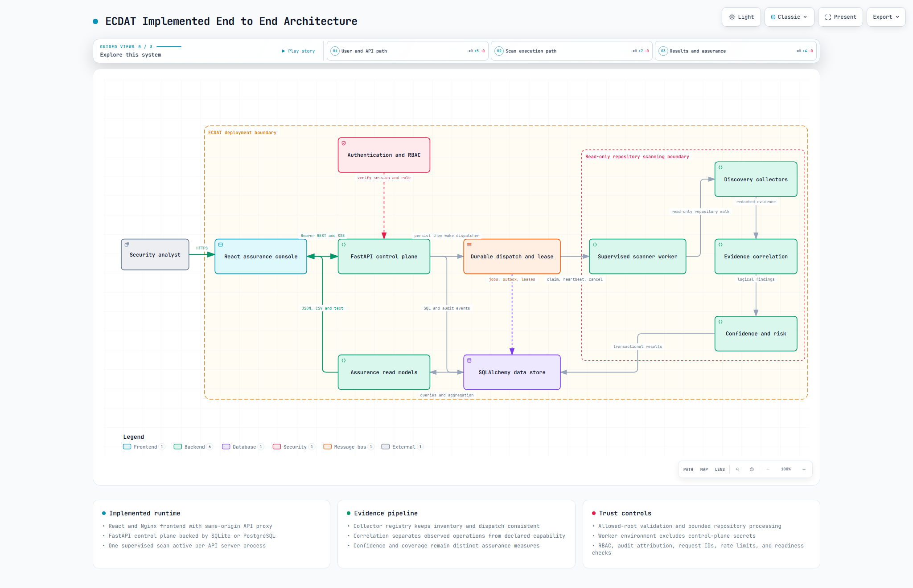
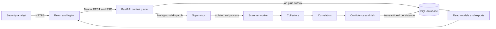
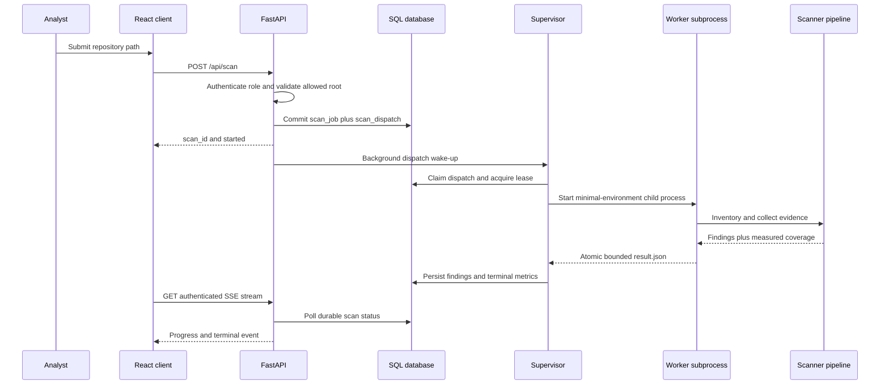
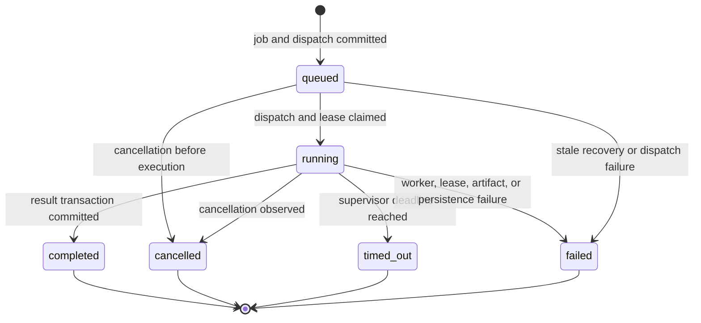
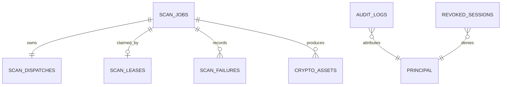

# ECDAT Implemented Architecture

**End to end frontend backend scanner data and deployment architecture**  
**Repository:** `ECDAT-SIH`  
**Architecture snapshot:** 20 September 2026  
**System version:** FastAPI application `1.0.0`

## Executive summary

ECDAT is a local-first cryptographic discovery and assurance platform. A React web console accepts an authenticated repository scan request, a FastAPI control plane validates and durably records it, and a supervised child process scans a read-only local repository. The scanner collects Python AST, multi-language rule, dependency-manifest, and X.509 evidence. The backend correlates that evidence into logical cryptographic operations, computes confidence and post-quantum migration risk, persists the results, and exposes dashboards, inventory, evidence graphs, CBOM, risk reports, evaluation metrics, CSV exports, and live scan progress.

The implemented system is intentionally bounded. It supports one active scanner worker per API server process, uses a database-backed dispatch record and lease rather than an external message broker, scans paths visible to the backend host, and uses configured HMAC-signed demo sessions rather than enterprise SSO. Local development defaults to SQLite. Docker Compose uses PostgreSQL 16, a FastAPI container, an Nginx-hosted React container, a migration job, and a read-only repository mount.

This document describes the code that exists in the current working tree. Future architecture described in planning files is not presented as implemented behavior.

## 1 System context



The main runtime path is:



### 1.1 Implemented technology stack

| Layer | Implemented technology | Primary responsibility |
|---|---|---|
| Browser application | React 18, TypeScript, React Router, Recharts, Framer Motion | Authentication shell, scan workflow, inventory, analysis, exports |
| Static serving and reverse proxy | Nginx unprivileged image | Serve compiled SPA, proxy `/api/`, security headers, disable SSE buffering |
| API control plane | FastAPI, Pydantic, Uvicorn | Validation, authentication, authorization, job control, queries, reports |
| Persistence | SQLAlchemy and Alembic | Jobs, dispatch state, leases, failures, findings, audits, revoked sessions |
| Local database | SQLite | Single-machine development and tests |
| Compose database | PostgreSQL 16 | Durable container deployment storage |
| Scanner | Python static analysis | Repository inventory, bounded reads, evidence collection and redaction |
| Worker isolation | Supervised Python subprocess | Run repository-controlled parsing without API credentials |
| Quality system | Pytest, Vitest, Playwright, axe-core, Ruff, mypy, ESLint, Prettier | Unit, integration, contract, accuracy, accessibility, and end-to-end checks |

## 2 Repository structure and ownership

```text
ECDAT-SIH/
├── dashboard/                 React SPA and Nginx production image
│   ├── src/App.tsx            Authentication shell and route composition
│   ├── src/api/client.ts      Session-aware REST, streaming, and downloads
│   ├── src/pages/             User-facing workflows
│   ├── src/components/        Shared presentation and assurance components
│   └── e2e/                   Playwright browser scenarios
├── backend/                   FastAPI control plane
│   ├── main.py                App, middleware, router wiring, health/readiness
│   ├── routers/               HTTP commands, queries, streams, and exports
│   ├── services/              Admission, worker supervision, analysis, scoring
│   ├── models/                SQLAlchemy persistence model
│   ├── schemas/               Pydantic request and response contracts
│   ├── middleware/            Rate limiting and database retry helpers
│   └── scan_worker.py         Credential-minimized subprocess entry point
├── scanner/                   Repository discovery engine
│   ├── main.py                Inventory, budgets, collector orchestration
│   ├── collectors/            AST, rules, dependency, certificate collectors
│   ├── rules/                 Versioned crypto pattern registry
│   ├── models/                In-memory evidence record
│   ├── corpus/ and corpora/   Labeled benchmark and holdout material
│   └── redaction.py           Evidence sanitization
├── alembic/                   Schema migration chain through revision 0008
├── scripts/                   Seeding, evaluation, calibration, validation
├── tests/                     Cross-layer and scanner regression tests
├── docker-compose.yml         PostgreSQL, migration, API, and dashboard
└── .github/workflows/         CI and scheduled benchmark pipelines
```

The browser never scans files directly. The FastAPI process owns policy and job control. The child worker owns parsing and produces a bounded JSON artifact. The control plane owns final scoring and transactional persistence.

## 3 Runtime topology

### 3.1 Local development mode

- Vite serves the dashboard on port `3000` and proxies `/api` to `localhost:8000`.
- Uvicorn serves `backend.main:app` on port `8000`.
- SQLAlchemy uses `sqlite:///./ecdat.db` unless `DATABASE_URL` is set.
- The operator must configure signed-session credentials and either allowed scan roots or the explicit local unrestricted-scan switch.
- The scanner runs as a child of the API process, not as a separate daemon.

### 3.2 Docker Compose mode

| Service | Image or build | Network exposure | Storage and trust behavior |
|---|---|---|---|
| `db` | `postgres:16-alpine` | `127.0.0.1:5432` | Named `pgdata` volume and health check |
| `migrate` | Backend image | Internal only | Runs `alembic upgrade head` before API startup |
| `backend` | Python 3.11 slim | `127.0.0.1:8000` | Non-root, read-only filesystem, `/tmp` tmpfs, all capabilities dropped |
| `dashboard` | Node build plus unprivileged Nginx | `127.0.0.1:3000` | Static SPA, same-origin API proxy, response security headers |

The Compose backend receives `./test-repo` as `/test-repo:ro` and limits scans to that root. The container is capped at 1 GiB memory, 2 CPUs, 256 processes, and a bounded open-file limit.

### 3.3 Request routing

In development, Vite proxies `/api`. In Compose, Nginx serves the SPA and proxies `/api/` to `backend:8000`. Nginx disables proxy buffering for progress streams and allows up to 360 seconds for the proxied response. Direct API URLs remain possible through `VITE_API_URL`, but the default is same-origin traffic.

## 4 Frontend architecture

### 4.1 Application shell and authentication state

`dashboard/src/App.tsx` is the browser composition root. It restores a session, displays the login page when signed out, listens for session-expiry events, renders navigation and account controls, and lazy-loads most pages. A global error boundary contains rendering failures, and the toast provider carries transient feedback.

`dashboard/src/api/client.ts` is the sole HTTP boundary. It:

- stores the access token, role, and expiry in memory and `sessionStorage`;
- validates local expiry and restores identity through `GET /api/auth/me`;
- attaches `Authorization: Bearer <token>` to authenticated calls;
- clears the session and dispatches `ecdat-session-expired` after a 401 or timer expiry;
- converts 403 responses to a permission message;
- implements authenticated fetch streaming for SSE because native `EventSource` cannot attach the bearer header;
- creates browser downloads for server exports and client-built CSV files.

The browser uses role state only to hide or disable write affordances. The API remains the authorization authority.

### 4.2 Route map

| Browser route | Page | Main backend dependencies | User outcome |
|---|---|---|---|
| `/` | Dashboard | Summary, evaluation, scans, filtered assets, risk text export | Overall exposure and recent scan status |
| `/assets` | AssetsPage | Paginated and filtered assets | Search, sort, select, and export inventory |
| `/assets/:id` | AssetDetail | Asset detail and asset patch | Inspect evidence and edit business risk context |
| `/scan` | ScanPage | Create scan, scan list, scan detail, SSE | Start and monitor a repository scan |
| `/scans/:id` | ScanDetailPage | Scan detail, assets, scans, SSE | Review lifecycle, coverage, failures, and findings |
| `/reports` | RiskReport | Risk report, evaluation, CSV export | Prioritized PQC migration view |
| `/cbom` | CbomPage | CBOM, evidence graph, risk report, CSV export | Cryptographic bill of materials |
| `/evidence-graph` | EvidenceGraphPage | Evidence graph | Explore evidence-to-asset support links |
| `*` | NotFound | None | Recover from an unknown route |

### 4.3 Frontend data behavior

- Pages use React hooks and local state; there is no external global state library.
- URL search parameters preserve scan selection and several filters.
- Dashboard and report visualizations are lazy-loaded to reduce initial bundle cost.
- Asset list filtering and pagination execute on the server. Selected-row CSV creation executes in the browser.
- CBOM and risk CSV exports execute on the server so they can stream the full result set.
- The frontend build enforces JavaScript, CSS, and gzip bundle budgets.
- Accessibility support includes a skip link, focus restoration, keyboard-capable dialogs, reduced-motion support, labeled fields, theme controls, and automated axe checks.

### 4.4 Current frontend contract note

The scan form sends `max_depth` and `min_size`, but the current backend `ScanRequest` schema accepts only `repo_path`. Pydantic therefore ignores those extra fields. The controls are present in the browser but do not currently change scanner behavior.

## 5 Backend application architecture

### 5.1 FastAPI composition root

`backend/main.py` performs five jobs:

1. loads the project `.env` before modules read environment variables;
2. validates the schema revision and optionally creates development tables;
3. reconciles expired scan leases and optionally recovers stale jobs;
4. installs request ID, slow-request, optional Prometheus, timeout, and CORS middleware;
5. mounts authentication, scan, asset, dashboard, output, audit, and observability routers.

The expected database revision is `0008_scan_admission`. Readiness checks database connectivity, required tables, migration version, and required columns.

### 5.2 Middleware order and behavior

| Concern | Implementation | Behavior |
|---|---|---|
| Request identity | `RequestIdMiddleware` | Accepts a safe `X-Request-ID` or creates a UUID; returns it in the response |
| Slow requests | `SlowRequestMiddleware` | Emits structured timing logs above a threshold |
| Metrics | Optional Prometheus middleware | Counts requests and observes duration when enabled |
| Timeout | `TimeoutMiddleware` | Cancels request processing and returns 504 after the configured deadline |
| CORS | FastAPI CORS middleware | Allows configured origins, rejects wildcard origins in production settings |
| Validation safety | Custom 422 handler | Returns field location, type, and generic message without reflecting secrets |
| Rate limiting | Decorators on login and scan creation | Rolling-window client and identity limits with trusted-proxy handling |

### 5.3 Authentication and RBAC

The implemented identity system uses configured users and one-hour HMAC-SHA256 signed bearer sessions.

```text
login credentials
  -> constant-time password comparison
  -> payload {sub, role, exp, sid}
  -> URL-safe base64 payload plus HMAC signature
  -> browser sessionStorage
  -> Authorization bearer header
  -> signature, expiry, account-role, and revocation checks
  -> Principal(subject, role, session_id, expires_at)
```

Roles are `admin`, `security_analyst`, `auditor`, and `viewer`.

| Capability | Admin | Security analyst | Auditor | Viewer |
|---|:---:|:---:|:---:|:---:|
| Read scans, assets, dashboard, and outputs | Yes | Yes | Yes | Yes |
| Create or cancel scans | Yes | Yes | No | No |
| Edit asset risk context | Yes | Yes | No | No |
| Read audit history | Yes | No | Yes | No |
| Purge retained audit events | Yes | No | No | No |
| Read admin operational metrics | Yes | No | No | No |

An optional role header exists only for explicit local/test use and cannot be enabled in production. Session revocation is backed by the database so all API replicas sharing that database can reject a revoked session.

### 5.4 API catalog

All `/api/scan`, `/api/scans`, `/api/assets`, `/api/dashboard`, and output routes require authentication through router-level dependencies. Mutation endpoints apply additional write-role checks.

| Method | Path | Access | Purpose |
|---|---|---|---|
| `POST` | `/api/auth/login` | Public, rate limited | Issue signed session |
| `GET` | `/api/auth/me` | Authenticated | Validate session and return role |
| `POST` | `/api/scan` | Admin or security analyst | Validate path, persist job and dispatch, wake dispatcher |
| `POST` | `/api/scans/{id}/cancel` | Admin or security analyst | Persist cancellation request and signal local worker |
| `GET` | `/api/scans` | Authenticated | Paginated scan history with `X-Total-Count` |
| `GET` | `/api/scans/{id}` | Authenticated | Scan metrics, blind spots, and structured failures |
| `GET` | `/api/scans/{id}/events` | Authenticated | SSE progress stream polled from durable job state |
| `GET` | `/api/assets` | Authenticated | Latest or selected scan inventory with filters and pagination |
| `GET` | `/api/assets/{id}` | Authenticated | Full asset and evidence detail |
| `PATCH` | `/api/assets/{id}` | Admin or security analyst | Update context and recompute risk in one transaction |
| `GET` | `/api/dashboard/summary` | Authenticated | Aggregate counts, coverage, confidence, and risk distribution |
| `GET` | `/api/cbom` | Authenticated | Paginated CBOM JSON |
| `GET` | `/api/cbom.csv` | Authenticated | Complete streaming CBOM CSV |
| `GET` | `/api/reports/risk` | Authenticated | Paginated migration-priority JSON |
| `GET` | `/api/reports/risk.csv` | Authenticated | Complete streaming risk CSV |
| `GET` | `/api/reports/risk.txt` | Authenticated | Complete text risk report |
| `GET` | `/api/evidence-graph` | Authenticated | Bounded evidence graph with truncation metadata |
| `GET` | `/api/evaluation` | Authenticated | Ground-truth precision, recall, F1, and metadata accuracy |
| `GET` | `/api/calibration` | Authenticated route in output router | Confidence bands and calibration metrics |
| `GET` | `/api/audit-logs` | Admin or auditor | Paginated attributed audit history |
| `DELETE` | `/api/audit-logs/retention/purge` | Admin | Delete old rows and append a purge audit event |
| `GET` | `/api/admin/metrics` | Admin | In-process scan performance percentiles |
| `GET` | `/metrics` | Admin, conditional | Prometheus exposition when enabled |
| `GET` | `/health` | Public | Process liveness and version |
| `GET` | `/ready` | Public | Configuration, database, and schema readiness |

## 6 End to end scan lifecycle



### 6.1 Admission and durable acceptance

1. The API verifies a signed session and requires a write role.
2. `resolve_repository` rejects null bytes, parent traversal, overlong paths, missing paths, non-directories, and paths outside configured roots.
3. `enqueue_scan` creates `scan_jobs(status="queued")` and a matching `scan_dispatches(state="pending")` in one commit.
4. The public response returns `scan_id` and `status: started` after durable acceptance.
5. A FastAPI background task performs the process-local dispatcher wake-up.

The database record is durable, but the dispatcher is not a continuously running external queue consumer. A process failure between commit and background wake-up can leave pending work for operational recovery.

### 6.2 Claim and lease

The dispatcher reserves the single process-local slot, atomically claims an eligible dispatch row, acquires a scan lease, marks the job running, and starts supervision. Dispatch and lease TTLs are the scan timeout plus a 60-second grace period. Heartbeats renew both ownership records. An expired claim can be reclaimed, and startup reconciles expired leases.

### 6.3 Worker isolation

The supervisor launches `python -m backend.scan_worker <repo> <result>` in a new process group. Its environment is allowlisted and excludes database URLs, user credentials, token secrets, and other control-plane secrets. `HOME` and temporary-directory variables point to a job-specific temporary workspace.

On Windows, cancellation and timeout use `taskkill /T /F`; on POSIX they terminate the process group, escalate to `SIGKILL` if necessary, and wait for confirmed exit. Standard input, output, and error are detached from the API process.

The worker performs analysis without database access, serializes one bounded JSON object to a temporary file, and atomically renames it to `result.json`. The supervisor rejects a missing or oversized artifact before parsing.

### 6.4 Cancellation timeout and terminal states



Cancellation is stored in `scan_dispatches.cancellation_requested_at`, which makes it visible across API replicas. The local control object also carries a threading event for fast local interruption. Terminal cleanup updates the job, closes the dispatch claim, records audit context where possible, and releases the lease.

### 6.5 Idempotent result delivery

Each dispatch has a `version`. `persist_scan_result` locks the job row and compares that version to `scan_jobs.result_version`. A duplicate or older delivery returns the already stored result summary instead of creating duplicate assets. Active-state checks prevent results from overwriting terminal jobs.

## 7 Scanner architecture

### 7.1 Inventory and scope

`scanner/main.py` performs one shared repository inventory. The collector registry is the source of truth for both “file is in scope” and “which handlers process it,” preventing coverage and dispatch from drifting apart.

Default excluded directories are `.git`, `node_modules`, `dist`, `build`, `__pycache__`, and common tool caches. The `source` profile also excludes `.venv`, `venv`, and `env`; the `environment` profile includes those environment directories. Linked directories are not followed. Linked files, oversized files, unreadable files, parse errors, and certificate errors become structured failure records.

The scanner enforces:

- maximum inventory file count;
- maximum bytes per file;
- maximum evidence count;
- optional elapsed-duration budget;
- optional process-memory budget;
- bounded worker-result bytes.

Coverage is `successfully processed supported files / supported files`. It is not a claim of detection completeness.

### 7.2 Collector registry

| Collector | Inputs | Evidence semantics | Parser version |
|---|---|---|---|
| Python AST | `.py` | Imports are declared capability; resolved call sites are observed operations | `ast-v3` |
| Rule collector | `.py`, `.java`, `.js`, `.ts`, `.c`, `.cpp`, `.go`, `.cs`, `.rs` | Auditable JSON-registry matches after comment and string handling | `rule-v1` |
| Dependency collector | `requirements.txt`, `pom.xml`, `package-lock.json`, `Gemfile.lock`, `go.sum`, `Cargo.lock` | Package capability, direct/transitive metadata where available | `dep-v1` |
| Certificate collector | `.crt`, `.pem`, `.cer` | X.509 key, signature, validity, EKU, SAN, and usage metadata | `cert-v2` |

Python files can produce both AST and rule evidence. Exact dependency filenames take priority, then extension handlers are added without duplicate collector names.

### 7.3 Evidence record

The in-memory scanner record carries algorithm, category, source, file location, evidence detail, base confidence, usage, library, protocol, key size, evidence kind, parser version, source span, and confidence reasons. Evidence is redacted before it crosses the scanner boundary and again before persistence or API serialization.

Important evidence kinds are:

- `observed_operation`: a source operation such as a resolved call or rule-backed invocation;
- `configured_protocol`: configuration showing a protocol is enabled;
- `declared_capability`: an import or dependency that can provide cryptography;
- `artifact_metadata`: cryptographic properties of a certificate or artifact;
- `unknown`: evidence that cannot be assigned a stronger semantic class.

## 8 Correlation confidence and risk

### 8.1 Correlation

The default correlator is operation-aware v2. It groups evidence using component, algorithm, usage, evidence kind, location, and an operation anchor. It produces a stable logical asset ID, merges supporting sources, retains source-specific confidence, and only reports a cryptographic conflict when incompatible algorithms occur in the same operation/category context.

Optional correlator v3 is enabled with `ECDAT_CORRELATOR_VERSION=v3`. It uses file spans and semantic anchors, links nearby cross-collector evidence, records moved-line notes, and preserves ambiguous matches instead of silently merging them.

### 8.2 Confidence

`score_finding` combines the strongest source evidence, multi-source corroboration, and conflict penalties. It returns both the numeric score and human-readable reasons. Persisted assets retain collector parser versions and source confidence reasons so results remain explainable.

Confidence bands are versioned and loaded from `calibration_params.json`:

| Band | Default range | Interpretation |
|---|---:|---|
| High | 0.85 to 1.00 | Strong and consistent evidence |
| Medium | 0.60 to below 0.85 | Reliable single-source or typical-operation evidence |
| Low | 0.40 to below 0.60 | Weak signal or declared capability |
| Uncertain | 0.00 to below 0.40 | Indirect or insufficient evidence |

Brier score and expected calibration error are stored with the calibration version when available.

### 8.3 Risk model

The risk engine separates technical evidence from business context. It considers:

- whether the algorithm is quantum vulnerable;
- whether evidence proves confirmed use or only capability;
- business criticality and data sensitivity;
- data lifetime, migration time, and threat horizon;
- exposure and migration effort;
- confidence band and context provenance.

It returns a 0-100 priority score, `CRITICAL/HIGH/MEDIUM/LOW` label, explainable reasons, a use-case-aware migration recommendation, a hybrid-transition flag, quantum-vulnerability status, and provenance for each risk-context input.

Asset updates change only approved context fields. The API recomputes risk and writes the updated asset plus its attributed audit event in one database transaction.

## 9 Persistence architecture



### 9.1 Tables

| Table | Architectural purpose | Important fields |
|---|---|---|
| `scan_jobs` | User-visible scan lifecycle and metrics | status, timestamps, result version, coverage, duration, collector stats, blind spots |
| `scan_dispatches` | Durable admission/outbox and cancellation state | version, state, claim owner/expiry, heartbeat, attempts, cancellation time |
| `scan_leases` | Exclusive active worker ownership | worker ID, acquired/expiry times, released flag |
| `scan_failures` | Structured per-file processing failures | relative path, reason, timestamp |
| `crypto_assets` | Correlated evidence-backed finding and derived risk | logical ID, algorithm, evidence, confidence, risk context, priority, provenance |
| `audit_logs` | Attributed security-sensitive event history | subject, role, session ID, action, resource, details, timestamp |
| `revoked_sessions` | Cross-replica signed-session deny list | session ID, subject, expiry, revocation time |

Foreign keys use cascade deletion from scan jobs to dependent findings, failures, leases, and dispatch records. SQLite connections explicitly enable foreign-key enforcement. PostgreSQL is used in Compose. Alembic is the deployment schema authority.

### 9.2 Persistence transaction boundaries

- Scan job and dispatch record are committed together.
- Final results, scan metrics, and structured failures are committed together.
- Asset context changes and audit attribution are committed together.
- Audit retention deletion and its audit event are committed together.
- Failed result persistence rolls back the complete transaction.

## 10 Read models reports and exports

### 10.1 Dashboard summary

The dashboard reads the selected completed scan or the latest completed scan. It aggregates total assets, critical/high count, confidence average, coverage, blind spots, risk distribution, quantum-vulnerable count, conflicts, confirmed-use count, capability-only count, collector statistics, and latest scan ID.

### 10.2 Inventory and detail

The asset list supports scan selection, text search, risk filter, quantum filter, priority/confidence/algorithm sorting, offset pagination, and a filtered total count. The detail response carries sanitized evidence, spans, parser versions, confidence reasons, risk reasons, and editable business context.

### 10.3 CBOM

CBOM output identifies the scan and repository, includes coverage and blind spots, groups component and algorithm information, and exposes both paginated JSON and a complete streaming CSV. Stable UUID generation uses logical asset identity rather than database row order.

### 10.4 Risk report

The risk report ranks assets by priority, carries calibration metadata, explains confidence interpretation and risk reasons, and provides migration candidates. Interactive JSON is paginated. CSV and text downloads intentionally export the complete result set.

### 10.5 Evidence graph

The evidence graph creates asset nodes and supporting-source nodes. It applies explicit asset, node, and edge limits and returns `truncation` metadata containing configured limits, returned counts, total assets, and reasons. The UI can therefore distinguish a complete graph from a bounded preview.

### 10.6 Evaluation

When the scanned repository contains `ground_truth.json`, evaluation measures operation-level true positives, false positives, false negatives, precision, recall, F1, usage accuracy, key-size accuracy, metadata-pair accuracy, per-source performance, duplicate findings, missed operations, unexpected operations, and certificate accuracy. Without valid ground truth, the API reports evaluation as unavailable rather than inventing metrics.

## 11 Progress observability and operations

### 11.1 SSE progress

The authenticated SSE endpoint polls the durable scan job every 500 milliseconds. It emits only changed payloads and sends a terminal `done` event for `completed`, `failed`, `cancelled`, or `timed_out`. Streams also stop on client disconnect or the configured poll limit.

The worker updates collector progress through the database. The final event includes status, collector statistics, asset count, coverage, duration, and blind spots.

### 11.2 Logs and metrics

- Structured logs carry request IDs and component-specific logger names.
- Slow-request middleware records latency outliers.
- In-process scan metrics expose percentile ranks to admins.
- Optional Prometheus middleware records request count and duration and exposes an admin-only `/metrics` endpoint.
- Health is a lightweight liveness response; readiness validates security configuration and the database schema.

### 11.3 Audit trail

Audited events include scan start, cancellation request, scan finish, lease acquisition/release/expiry, asset context updates, and audit retention purge. Newer schema revisions store subject, role, session ID, and expiry rather than only a role string.

## 12 Security architecture

### 12.1 Trust boundaries

| Boundary | Controls |
|---|---|
| Browser to Nginx/API | Same-origin proxy, CSP, frame denial, content-type protection, bearer session, CORS allowlist |
| API command boundary | Pydantic validation, generic 422 errors, rate limiting, RBAC, request timeout |
| Repository boundary | Real-path resolution, traversal rejection, allowed-root enforcement, read-only Compose mount |
| Worker boundary | Minimal environment, no API/database credentials, separate process group, bounded time/memory/files/result |
| Evidence boundary | Redaction in scanner, persistence path, and API serialization |
| Database boundary | Migrations, foreign keys, transaction rollback, result-version idempotency, audit attribution |

### 12.2 Secure defaults

Production settings fail readiness when token secrets, users, scan roots, or CORS origins are unsafe. Production forbids the demo role header and unrestricted scan roots. Account passwords must be distinct and sufficiently long, and the token secret must differ from account passwords.

### 12.3 Explicit non-capabilities

The implemented scanner does not perform runtime tracing, packet capture, HSM discovery, cloud KMS inventory, binary reverse engineering, container-image inspection, or automated source rewriting. It does not upload source code to an external service. These are declared blind spots, not silent assumptions.

## 13 Configuration architecture

| Variable | Default or requirement | Architectural effect |
|---|---|---|
| `DATABASE_URL` | SQLite local; PostgreSQL in Compose | Selects persistence backend |
| `ECDAT_ENV` | `local`, `test`, or `production` | Enables production safety validation |
| `ECDAT_TOKEN_SECRET` | Required, 32+ characters | HMAC session signing |
| `ECDAT_USERS_JSON` | Required account map | Local identity and role source |
| `ECDAT_CORS_ORIGINS` | Localhost defaults | Browser origin allowlist |
| `ECDAT_ALLOWED_SCAN_ROOTS` | Required in production | Repository trust boundary |
| `ECDAT_ALLOW_UNRESTRICTED_SCAN_ROOTS` | `false` | Explicit local-only escape hatch |
| `ECDAT_ALLOW_ROLE_HEADER` | `false` | Explicit local/test auth fallback |
| `ECDAT_REQUEST_TIMEOUT` | 120 seconds | API request deadline |
| `ECDAT_SCAN_TIMEOUT_SECONDS` | 300 seconds | Supervisor deadline and lease basis |
| `ECDAT_MAX_FILE_BYTES` | 8 MiB | Per-file scan limit |
| `ECDAT_MAX_SCAN_FILES` | 100000 | Repository inventory limit |
| `ECDAT_MAX_EVIDENCE` | 100000 | Evidence cardinality limit |
| `ECDAT_MAX_WORKER_RESULT_BYTES` | 32 MiB | Worker artifact boundary |
| `ECDAT_SCAN_DURATION_BUDGET_MS` | 0, disabled | Optional scanner-internal duration budget |
| `ECDAT_SCAN_MEMORY_BUDGET_MB` | 512 MiB | Scanner memory budget |
| `ECDAT_SCAN_PROFILE` | `source` | Source versus environment inventory policy |
| `ECDAT_CORRELATOR_VERSION` | `v2` | Selects operation v2 or span-aware v3 |
| `ECDAT_RECOVER_STALE_JOBS` | `false` | Applies startup stale-job recovery when enabled |
| `ECDAT_AUTO_CREATE_TABLES` | `false` | Development schema creation and stamping |
| `ECDAT_ENABLE_PROMETHEUS` | `false` | Metrics middleware and endpoint |
| `ECDAT_TRUSTED_PROXIES` | Empty | Controls trusted forwarded client identity |

## 14 Build test and release architecture

### 14.1 Continuous integration

The main CI workflow contains independent jobs for:

- Python linting and incremental type checking;
- frontend formatting, linting, and TypeScript checking;
- backend and scanner tests with coverage;
- benchmark arithmetic and precision regressions;
- labeled corpus evaluation;
- calibration dataset verification;
- frontend unit tests;
- production frontend build and bundle budgets;
- API contract tests;
- performance budget tests;
- schema generation and validation;
- axe-core accessibility checks;
- Playwright end-to-end browser workflows.

A scheduled weekly benchmark workflow reevaluates corpora, runs regression tests, refreshes calibration artifacts, and compares overall precision against a baseline.

### 14.2 Test boundaries

The codebase contains backend route/service tests, scanner discovery and accuracy regressions, database migration tests, worker-isolation and lifecycle tests, frontend component/page tests, and full-browser tests. Controlled corpora and holdout manifests make detector behavior reproducible.

## 15 Architectural constraints and extension points

### 15.1 Current constraints

1. **Single active scan per API process.** The `_active` control slot rejects another local scan with HTTP 409.
2. **No independent dispatcher service.** Durable dispatch state exists, but normal wake-up is a FastAPI background task.
3. **Host-visible repository paths.** Intake is a local path; there is no Git provider clone, archive upload, or immutable snapshot service.
4. **Local signed-session identity.** Enterprise OIDC, SSO, MFA, and tenant mapping are not implemented.
5. **Database-polled progress.** SSE is fed by half-second database polling rather than a broker or event stream.
6. **Process-local rate-limit and performance state.** Horizontal replicas do not share those in-memory counters.
7. **Evidence graph is intentionally bounded.** Large scans return explicit truncation metadata.
8. **Frontend scan tuning mismatch.** `max_depth` and `min_size` are not represented in the backend request contract.

### 15.2 Natural extension seams

| Desired evolution | Existing seam |
|---|---|
| External queue and worker pool | `scan_dispatches`, lease service, result versioning, worker JSON contract |
| Provider-based repository intake | `resolve_repository` boundary and worker repository argument |
| Enterprise SSO | `current_role` and `Principal` dependency boundary |
| Multi-tenant storage | SQLAlchemy models, audit principal, router query filters |
| Additional detectors | `CollectorRegistry`, normalized `CryptoAsset`, versioned parser metadata |
| New correlator | `ECDAT_CORRELATOR_VERSION` selection and normalized evidence contract |
| Object storage exports | Output router boundary and streaming download client |
| Shared operational telemetry | Prometheus adapter and structured logging layer |

## 16 Startup and shutdown flow

### 16.1 Startup

1. Load `.env` without overriding existing environment variables.
2. Build typed settings; retain a safe degraded boot path so readiness can return 503.
3. Inspect the Alembic revision.
4. Optionally create and stamp a development schema.
5. Optionally recover stale jobs.
6. Reconcile expired scan leases.
7. Start serving health, readiness, auth, and application routes.

### 16.2 Normal shutdown behavior

The application does not host a permanent queue consumer. Active scan cleanup is primarily owned by the supervisor `finally` path, which terminates the process tree, marks terminal status when appropriate, finalizes dispatch state, and releases the lease. If the API process dies abruptly, TTL-based lease and dispatch recovery provide the durable recovery seam.

## 17 Source of truth map

| Architectural subject | Primary source files |
|---|---|
| Browser routes and session shell | `dashboard/src/App.tsx` |
| Browser API contract | `dashboard/src/api/client.ts`, `dashboard/src/types.ts` |
| Page behavior | `dashboard/src/pages/*.tsx` |
| Reverse proxy and headers | `dashboard/nginx.conf` |
| API composition and readiness | `backend/main.py`, `backend/readiness.py`, `backend/settings.py` |
| Authentication and audit principal | `backend/security.py`, `backend/routers/auth.py`, `backend/routers/audit.py` |
| Scan admission and SSE | `backend/routers/scan.py`, `backend/services/scan_control.py` |
| Worker and pipeline boundary | `backend/scan_worker.py`, `backend/services/scanner_runner.py` |
| Inventory and collectors | `scanner/main.py`, `scanner/collectors/registry.py`, `scanner/collectors/*.py` |
| Correlation | `backend/services/correlator.py`, `backend/services/correlator_v3.py` |
| Confidence calibration and risk | `backend/services/confidence.py`, `backend/services/calibration.py`, `backend/services/risk_engine.py` |
| Database schema | `backend/models/*.py`, `alembic/versions/*.py` |
| Query and export models | `backend/routers/assets.py`, `dashboard.py`, `outputs.py`, `observability.py` |
| Deployment | `docker-compose.yml`, `backend/Dockerfile`, `dashboard/Dockerfile` |
| Verification | `.github/workflows/*.yml`, `tests/`, `backend/tests/`, `dashboard/src/**/*.test.tsx`, `dashboard/e2e/` |

## 18 Architecture conclusion

The implemented ECDAT design has a clear control plane and data plane split. FastAPI owns policy, durable job state, identity, and persistence. A credential-minimized subprocess owns repository parsing. Evidence moves through explicit collection, correlation, confidence, and risk stages before it becomes a persisted asset. The React application consumes stable read models rather than reproducing analysis logic in the browser.

The strongest production-oriented elements already present are durable admission records, expiring worker leases, idempotent result versions, explainable evidence and risk provenance, read-only deployment mounts, bounded worker artifacts, migration-aware readiness, and broad automated verification. The main scaling boundary is orchestration: dispatch wake-up, concurrency, rate limits, and progress delivery remain local to an API process. The existing contracts make an external queue and isolated worker pool a contained future evolution rather than a redesign of the evidence model.

---

### Generated architecture artifacts

- Interactive architecture diagram: `docs/architecture-assets/ecdat-current.architecture.html`
- Validated diagram specification: `docs/architecture-assets/ecdat-current.architecture.json`
- Browser evidence: `docs/architecture-assets/ecdat-current.architecture.visual-check.json`

