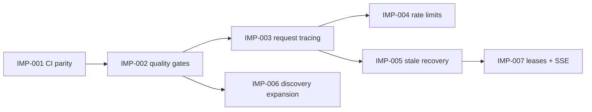

# ECDAT-SIH Implementation Plan

Updated: 2026-09-10



Status: IMP-001 through IMP-005 are implemented and locally verified. IMP-006 is partial. IMP-007 has database leases and authenticated SSE, while a durable external queue and reconnect cursor remain deferred.

This file converts the improvement roadmap into executable work packages. Each package should be delivered as a focused commit or pull request and must leave the repository deployable.

## Protected baseline

- Recovery commit: `877f100d52e35f8af99450502425a7ba7689fe43`
- Rollback branch: `rollback/frontend-recovery-2026-09-09`
- Annotated rollback tag: `rollback-frontend-recovery-2026-09-09`
- Working branch: `fix/sha1-recommendation`

Baseline verification:

- Backend: 118 passed, 1 skipped
- Frontend: 22 passed
- Browser E2E: 7 passed
- Frontend formatting and production build: passed
- Live readiness: API `ready`, dashboard HTTP 200

## Delivery rules

1. Start each behavior change with one failing regression test.
2. Keep commits scoped to one work package.
3. Do not combine schema migrations with unrelated UI changes.
4. Preserve explainable evidence, redaction, RBAC, cancellation, timeout, and coverage behavior.
5. Run the package gate plus the full release gate before pushing.
6. Use `git revert` for published failures; do not rewrite shared history.

## Work package order

### IMP-001 — CI parity

**Priority:** P0

**Estimate:** 1 day

**Depends on:** protected baseline

Change:

- Update `.github/workflows/ci.yml` to run `pytest` instead of unittest discovery.
- Add `npm test` after dependency installation.
- Add a Playwright Chromium job with trace and screenshot artifacts on failure.
- Cache Playwright browser binaries using the lockfile as the cache key.

Tests:

- Introduce a temporary pytest-only sentinel test and prove the old CI command misses it.
- Validate the workflow syntax and run every command locally.

Done when:

- CI reports the same backend, frontend, build, format, and E2E suites as local verification.
- A failure in any suite blocks the workflow.

### IMP-002 — Repository consistency gates

**Priority:** P0

**Estimate:** 0.5 day

**Depends on:** IMP-001

Change:

- Add explicit text-file end-of-line rules to `.gitattributes`.
- Add Ruff configuration and a minimal ESLint configuration.
- Add backend and frontend coverage reports without enforcing speculative targets.
- Record measured coverage, then set initial floors below the measured baseline.

Tests:

- Run formatting twice and assert the second run leaves `git status` clean.
- Add one deliberate lint violation locally and prove CI rejects it before removing it.

Done when:

- Windows and Linux produce identical normalized diffs.
- Lint, test, coverage, and build commands are documented in `README.md`.

### IMP-003 — Request IDs and structured logging

**Priority:** P1

**Estimate:** 2 days

**Depends on:** IMP-001

Change:

- Add `backend/logging_config.py` using the standard logging package and JSON output.
- Add request-ID middleware in `backend/main.py`.
- Return `X-Request-ID` and attach the same value to request, audit, scan-supervisor, and worker logs.
- Replace scanner and application `print` calls incrementally.
- Centralize redaction of tokens, credentials, raw evidence, and unrestricted paths.

Tests:

- Assert a supplied safe request ID is preserved and an invalid value is replaced.
- Assert one generated ID appears in the response, audit record, and captured log.
- Assert sensitive canary values never appear in serialized logs.

Done when:

- API-to-worker events can be correlated by one identifier.
- Structured logs remain readable locally and contain no sensitive test canaries.

### IMP-004 — Endpoint-aware rate limits

**Priority:** P1

**Estimate:** 1–2 days

**Depends on:** IMP-003

Change:

- Introduce configuration-backed policies for login, scan submission, default API traffic, and health probes.
- Key authentication limits conservatively without trusting spoofable forwarding headers by default.
- Return `429` with `Retry-After` and request ID.
- Document the single-process limitation and the external-store requirement for multiple replicas.

Tests:

- Prove login and scan limits are independent.
- Prove `/health` and `/ready` remain available during throttling.
- Prove the window expires deterministically using a mocked monotonic clock.

Done when:

- Brute-force and expensive scan requests are constrained without blocking health checks.

### IMP-005 — Interrupted-scan recovery

**Priority:** P1

**Estimate:** 1 day

**Depends on:** IMP-003

Change:

- Move stale-job rules from `scripts/cleanup_stale_scans.py` into a reusable service.
- Keep the script as an operations entry point.
- Run guarded reconciliation during application startup or deployment.
- Write an audit event for every recovered job.

Tests:

- Cover queued, running, completed, failed, recent, and stale jobs.
- Prove dry-run performs no writes.
- Prove repeated cleanup is idempotent.

Done when:

- A process crash cannot leave a job permanently active.

### IMP-006 — Discovery assurance expansion

**Priority:** P1

**Estimate:** iterative, 1–2 weeks

**Depends on:** stable CI and coverage gates

Change:

- Expand `test-repo/ground_truth.json` before changing collectors.
- Add lockfile-aware dependency evidence with resolved versions.
- Enrich certificate findings with expiry, signature algorithm, key strength, and trust role.
- Version detection rules and correlation behavior in persisted/exported evidence.
- Add large-repository performance budgets.

Tests:

- For each detector, add positive, negative, malformed, and conflicting examples.
- Add property-based tests for paths, key sizes, correlation identifiers, and redaction.
- Report precision and recall by collector and language.

Done when:

- Recall increases on committed ground truth without lowering the agreed precision floor.
- Every finding remains traceable to versioned evidence and a source location.

### IMP-007 — Persistent queue and progress events

**Priority:** P2

**Estimate:** 1–2 weeks

**Depends on:** IMP-003 and IMP-005

Change:

- Replace the process-local active-scan flag with database-backed claims and expiring worker leases.
- Add server-sent events for progress while retaining polling as a fallback.
- Add dashboard recovery actions and collector-level progress details.

Tests:

- Prove two API instances cannot claim the same job.
- Prove an expired lease is recoverable.
- Prove event reconnection resumes from persisted state.

Done when:

- Scans operate safely across multiple API processes and survive worker interruption.

## Full release gate

Run from the repository root:

```powershell
.\.venv\Scripts\python.exe -m pytest -q -p no:cacheprovider
cd dashboard
npm run format:check
npm test -- --reporter=dot
npm run build
npm run test:e2e
```

Also verify:

- `/ready` reports `ready` against the intended database.
- The dashboard loads, authenticates, starts a scan, shows progress, opens scan details, and exports CSV.
- `git diff --check` reports no whitespace errors.
- `git status --short` contains only intentional files.
- No `.env`, database, log, test result, browser binary, or build output is staged.

## Safe rollback procedures

Inspect changes since the protected recovery:

```powershell
git diff rollback-frontend-recovery-2026-09-09..HEAD
```

Create an isolated recovery branch without changing published history:

```powershell
git switch -c rescue/frontend-recovery rollback-frontend-recovery-2026-09-09
```

Undo a specific published change on the active branch:

```powershell
git revert <bad-commit-sha>
git push origin fix/sha1-recommendation
```

Verify the protected commit directly:

```powershell
git show rollback-frontend-recovery-2026-09-09
git rev-parse rollback/frontend-recovery-2026-09-09
```

Do not delete the rollback branch or tag until a newer verified recovery point replaces both.
