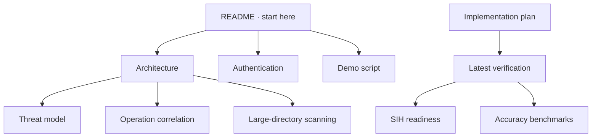

# ECDAT documentation map

Updated: 2026-09-10

## Current references

- [Architecture](ARCHITECTURE.md) — components, data flow and scan lifecycle.
- [Authentication](authentication.md) — session provisioning, roles and limitations.
- [Threat model](THREAT_MODEL.md) — boundaries, controls and accepted risk.
- [Implementation](IMPLEMENTATION.md) — delivered and remaining work packages.
- [SIH readiness](SIH_READINESS.md) — presentation checklist.
- [Demo script](DEMO_SCRIPT.md) — five-minute product walkthrough.
- [Operation correlation](operation-correlation.md) and [large-directory scanning](large-directory-scanning.md) — technical behavior.

## Verification and evidence

- [Verification — 2026-09-10](verification-2026-09-10.md) — current local evidence.
- Older dated verification and accuracy documents are immutable historical snapshots; their top banners point to the current report.
- [Benchmark protocol](../benchmarks/README.md) — external corpus procedure.

## Planning

- [Current implementation plan](IMPLEMENTATION.md)
- [Claude improvement plan](CLAUDE_IMPROVEMENT_PLAN.md)
- [Improvement roadmap](improvements-plan-2026-09-09.md)
