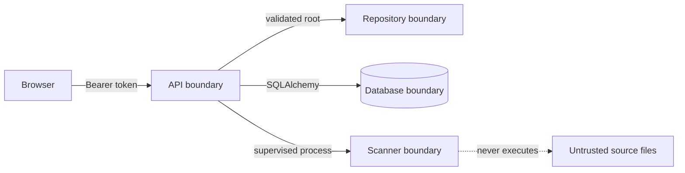

# ECDAT SIH threat model

## Protected assets

- Repository source and cryptographic metadata
- Scan history, risk context and audit history
- Repository credentials in future connector deployments
- Integrity of discovery evidence and generated reports

## Trust boundaries

1. Browser to API
2. API to database
3. API to repository filesystem
4. Scanner to untrusted source files and certificates
5. Container host to read-only repository volume

## Prototype controls

| Threat | Current control |
|---|---|
| Unauthorized mutation | Signed HMAC demo sessions, roles and audited mutations |
| Arbitrary filesystem scanning | Canonical path resolution and configurable allowed scan roots |
| Cross-origin browser access | Explicit configurable CORS origin list |
| Evidence tampering | Evidence source, location and correlation context persisted per asset |
| Scan overstatement | Measured coverage plus explicit blind spots |
| Dependency compromise | Locked frontend dependencies, automated audit and CI |
| Accidental secret commit | `.gitignore`, generated-data exclusions and clean release checks |
| Brute force / scan abuse | Endpoint-aware in-process rate limits with `429` and `Retry-After` |
| Duplicate worker claim | Database-backed expiring scan lease plus process-local admission |
| Request tracing | Generated or propagated `X-Request-ID` in structured JSON logs |

## Accepted SIH prototype limitations

- Local demo credentials are operator-provisioned in an untracked environment file.
- Scan execution uses a supervised child process, but not a hardened OS sandbox.
- Source parsers do not execute scanned repository code.
- Binary, runtime, cloud KMS, network and HSM discovery remain declared blind spots.
- Current rate limits are process-local; multiple replicas require a shared limiter.
- A production deployment must add SSO, TLS, secret management, worker sandboxing and penetration testing.
