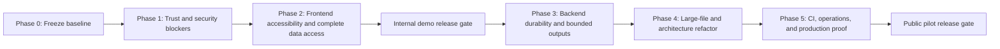

# ECDAT-SIH Full-Stack Audit Implementation Plan

> Date: 2026-09-14  
> Status: Phases 0-5 implementation complete; public-pilot proof awaits Docker and remote CI  
> Source: Combined frontend and backend audits of the current working tree  
> Release posture: Internal demo after Phase 2; public production only after Phase 5

## 1. Objective

Resolve the verified frontend and backend findings without weakening ECDAT's evidence-first product contract. The plan prioritizes truthful results, bounded resource use, accessible operation, authenticated accountability, and reproducible releases.

## 2. Priority and completion rules

| Priority | Meaning | Completion rule |
|---|---|---|
| P0 | Data loss, secret exposure, or remote compromise | Stop all release work until fixed |
| P1 | Release blocker or material trust/accessibility failure | Required before the next internal release candidate |
| P2 | Important reliability, maintainability, or UX risk | Required before public pilot |
| P3 | Cleanup or longer-term scalability improvement | Schedule after the public-pilot gate |

A work package is complete only when its implementation, automated tests, documentation, and rollback note are all merged. Passing unit tests alone is not sufficient.

## 3. Delivery sequence

Estimated effort is 24-35 engineer-days. Phase 1 and Phase 2 can run in parallel after Phase 0, but changes within each package should remain sequential to keep regressions attributable.

## 4. Phase 0 — Establish a reproducible baseline

**Estimate:** 1-2 engineer-days  
**Owner:** Tech lead / release engineer

### WP-0.1 Clean release surface

- Inventory and separate the current user-owned changes into focused commits: migrations, backend runtime, scanner/correlation, frontend, tests, and documentation.
- Do not commit local databases, logs, screenshots, `.runtime`, graph caches, coverage files, or credentials.
- Confirm that the two new Alembic revisions are included and ordered under the single `0006_provenance` head.
- Record the intended correlator default (`v2` or `v3`) as an explicit release decision.

**Acceptance criteria**

- `git status --short` contains no unexplained files before the release candidate is tagged.
- A clean clone can install dependencies and run the same checks as the developer machine.
- The release notes distinguish demo-safe capabilities from deferred production controls.

### WP-0.2 Lock the verification baseline

- Preserve the current passing baseline: 352 tests, 86 subtests, Ruff, configured mypy, migrations, frontend build/lint/format, and frontend unit/E2E suites.
- Add failure-producing regression tests before fixing each P1 defect.
- Correct coverage configuration so `backend/tests` is not counted as production coverage.

**Gate:** no P1 implementation begins without a failing regression test or a documented reason why one cannot be created.

## 5. Phase 1 — Trust and security blockers

**Estimate:** 6-9 engineer-days  
**Owner:** Backend/security engineer

### WP-1.1 Correct and harden rate limiting

**Files:** `backend/middleware/rate_limit.py`, authentication and middleware tests

- Replace `_prune` so it removes only timestamps outside the active window rather than deleting the complete client bucket.
- Ignore `X-Forwarded-For` unless requests arrive through an explicitly configured trusted proxy; otherwise use the socket peer address.
- Rate-limit login by both trusted client identity and normalized username so address rotation cannot remove account-level protection.
- Validate thresholds and windows during startup.
- Keep the current in-memory limiter for single-process demo mode, but define a shared-store interface for multi-replica deployments.

**Acceptance criteria**

- A threshold of two rejects the third request within every rolling 60-second interval.
- Forged forwarding headers do not change identity when trusted-proxy mode is disabled.
- Login responses retain `429` and a correct `Retry-After` header.
- Concurrency tests show no lost increments.

### WP-1.2 Fail readiness on unusable security configuration

**Files:** `backend/main.py`, `backend/security.py`, new centralized settings module

- Move environment parsing into one typed settings object loaded once at startup.
- Validate token secret, users JSON, CORS origins, allowed scan roots, timeouts, evidence/file limits, and correlator version.
- Make `/ready` fail when mandatory production settings are missing or invalid.
- Require non-empty allowed scan roots in production mode; retain the explicit unrestricted option only for local development.

**Acceptance criteria**

- Invalid JSON, weak secrets, invalid roles, invalid numeric limits, or missing production scan roots prevent readiness.
- Error responses remain generic; detailed causes appear only in server logs.
- Compose cannot become healthy with an authentication configuration that always returns 503.

### WP-1.3 Isolate scan execution

**Files:** `backend/services/scan_control.py`, worker entry point, deployment configuration

- Remove signing secrets and unrelated server configuration from the worker environment.
- Run each scan against a job-specific read-only workspace with a dedicated low-privilege identity.
- Apply wall-clock, CPU, process, file-descriptor, and memory limits outside the Python process.
- Disable worker network egress unless a future collector explicitly requires it.
- Keep job status and lease transitions in the control plane; workers return bounded result artifacts.

**Acceptance criteria**

- A worker cannot read the API token secret, database password, or paths outside its assigned workspace.
- Timeout and cancellation terminate the complete worker process tree.
- Malformed repositories cannot crash or exhaust the API process.
- Existing success, timeout, cancellation, and late-completion race tests continue to pass.

## 6. Phase 2 — Frontend release blockers and complete data access

**Estimate:** 6-8 engineer-days  
**Owner:** Frontend engineer with accessibility review

### WP-2.1 Repair mobile navigation

**Files:** `dashboard/src/App.tsx`, `dashboard/src/styles/pages.css`, `dashboard/src/styles/redesign.css`, responsive E2E tests

- Remove the specificity conflict between `.topbar nav` and `.topbar-nav`.
- Keep the closed menu absent from layout and the accessibility tree at mobile widths.
- Close it on route change, Escape, outside interaction, and focus transfer where appropriate.
- Keep `aria-expanded`, visual state, and actual visibility synchronized.

**Acceptance criteria**

- At 375px and 390px the closed menu consumes no layout space and no links are focusable.
- Opening moves focus predictably; closing restores focus to the menu button.
- Desktop navigation remains visible at supported desktop widths.
- E2E tests assert computed visibility, focus order, and absence of clipping rather than only CSS classes.

### WP-2.2 Meet WCAG 2.2 AA contrast and target sizing

**Files:** semantic color tokens and component styles

- Replace low-contrast primary, muted-text, source-badge, confidence, and filter colors in both themes.
- Raise essential metadata from 8.5-10.5px to a readable tokenized size.
- Give primary touch interactions an effective target of at least 44 by 44 CSS pixels or equivalent spacing.
- Preserve risk meaning without relying on color alone.

**Acceptance criteria**

- Normal text reaches 4.5:1 and large text reaches 3:1 in both themes.
- Automated axe checks report no serious or critical violations on every authenticated route.
- Manual keyboard and 200% zoom checks pass at 375, 768, 1024, and 1440px.

### WP-2.3 Make all CBOM and report records reachable

**Files:** `dashboard/src/pages/CbomPage.tsx`, `RiskReport.tsx`, API client, output routes

- Remove client-side `slice(0, 250)` before filtering.
- Add server-side pagination/filtering for interactive views and windowed rendering for large result sets.
- Keep complete export generation separate from interactive page payloads.
- Display total, loaded, filtered, and exported counts explicitly.

**Acceptance criteria**

- A component beyond position 250 can be searched, viewed, and exported.
- Pagination is stable under risk, algorithm, quantum, and text filters.
- A 10,000-record fixture does not render thousands of DOM nodes at once.
- API contract tests verify deterministic ordering and page boundaries.

### WP-2.4 Make the evidence graph truly operable

**Files:** `dashboard/src/components/EvidenceGraph.tsx` and tests

- Either implement meaningful Enter/Space/click/focus behavior for graph nodes or remove button semantics and individual tab stops.
- Provide an equivalent accessible list/table view for every graph relationship.
- Seed layout deterministically and avoid exposing 200 sequential tab stops.

**Acceptance criteria**

- Every element with `role="button"` performs the same action with mouse, Enter, and Space.
- Tooltip/detail information is available on focus and to screen readers.
- Snapshot positions are deterministic across repeated runs.

**Internal demo release gate**

- All WP-1 and WP-2 P1 acceptance criteria pass.
- No unexpected browser console error or failed API request is tolerated by E2E tests.
- Frontend build stays under explicit JS/CSS budgets.

## 7. Phase 3 — Backend durability, accountability, and bounded outputs

**Estimate:** 5-7 engineer-days  
**Owner:** Backend/data engineer

### WP-3.1 Bound report, CBOM, graph, and evaluation work

- Replace shared `.all()` loading with paged queries or streaming generation.
- Generate full CBOM and text reports as asynchronous, immutable artifacts with size limits and status polling.
- Put explicit node/edge limits on evidence graphs and return truncation metadata.
- Cap ground-truth item counts in addition to the current 2 MiB byte limit.
- Run expensive evaluation outside request threads and enforce a worker-level CPU deadline.

**Acceptance criteria**

- Requests have documented maximum response sizes and database row counts.
- A maximum-sized fixture stays within measured memory and latency budgets.
- Client disconnects and timeouts stop or safely detach work without orphaning uncontrolled threads.

### WP-3.2 Preserve authenticated identity and atomic audit events

- Replace the role-only dependency result with a principal containing subject, role, expiry, and session identifier.
- Store actor subject and role on audit events.
- Write asset mutation and its audit event in one database transaction.
- Audit every retention purge in an append-only or separately protected administrative stream.
- Add a server-side session-revocation strategy for production mode.

**Acceptance criteria**

- Two administrators produce distinguishable audit histories.
- Forced audit failure rolls back the protected mutation.
- Purge authorization, request parameters, result count, and actor remain auditable after the purge.

### WP-3.3 Durable scan admission

- Introduce an explicit queue/outbox boundary rather than relying on `BackgroundTasks` and process-local `_active` state.
- Make worker result persistence idempotent by scan/job version.
- Add lease heartbeats and reclaim only after confirmed expiry.
- Ensure cancellation can reach the worker selected by any API replica.

**Acceptance criteria**

- API restart after job acceptance does not lose the job.
- Duplicate delivery does not duplicate assets.
- Two API processes cannot execute the same job concurrently.
- Crash, retry, timeout, and cancellation integration tests pass against PostgreSQL.

## 8. Phase 4 — Large-file and architecture refactor

**Estimate:** 4-6 engineer-days  
**Owner:** Backend/scanner maintainers

### WP-4.1 Consolidate correlator v3

- Choose one v3 algorithm and remove the competing implementation and proxy indirection.
- Define typed input/output contracts and golden fixtures for identity, ambiguity, cross-kind links, and moved-line handling.
- Raise production-path coverage from 10.3% to at least 85% branch coverage.

### WP-4.2 Split runtime hotspots

| Current file | Refactoring boundary |
|---|---|
| `backend/services/evaluation.py` (806 lines) | ground-truth validation, operation matching, certificate evaluation, metrics DTOs |
| `scanner/collectors/dep_collector.py` (450 lines) | one parser per dependency format behind a common collector interface |
| `backend/main.py` (400 lines) | settings/startup, middleware, readiness, observability routes |
| `scanner/collectors/ast_collector.py` (376 lines) | symbol resolution, call classification, evidence construction |
| `scanner/main.py` (281 lines) | inventory, limits, orchestration, metrics |

- Refactor the 26 Ruff C901 hotspots toward complexity 10 or less, beginning with `correlator_v3.correlate`, `ast_collector.visit_Call`, and `scan_with_metrics`.
- Preserve output contracts with characterization tests before moving logic.

### WP-4.3 Treat the corpus generator as generated-data tooling

- Replace the 1,198-line repetitive generator with declarative templates while preserving the fixed seed and exact output hashes.
- Keep generated corpora separate from runtime packages and Docker images.
- Add a regeneration check that fails when committed manifests do not match generator output.

## 9. Phase 5 — CI, deployment, and production proof

**Estimate:** 3-5 engineer-days plus environment provisioning  
**Owner:** Platform/release engineer

### WP-5.1 Align and lock dependencies

- Test the same Python minor version used by the production image; optionally add 3.14 as a forward-compatibility matrix entry.
- Pin the Python base image and PostgreSQL image by digest for releases.
- Produce a hash-locked Python dependency file through an approved update workflow.
- Run Bandit and `pip-audit` in CI; define documented exception handling for accepted advisories.
- Extend mypy to the backend incrementally and prevent the checked scope from shrinking.

### WP-5.2 Repair benchmark and calibration automation

- Remove the same-run `download-artifact` dependency or retrieve a named artifact from a verified prior workflow through an explicit supported mechanism.
- Never hide calibration failure with `|| echo`; mark the job failed or explicitly skipped with a machine-readable reason.
- Validate generated corpus/calibration artifacts before upload and attach provenance.

### WP-5.3 Production operations gate

- Run Compose/PostgreSQL verification from a clean checkout.
- Rehearse migration upgrade and downgrade against a production-like data volume.
- Document and test PostgreSQL backup/restore, secret rotation, bad-release rollback, stuck-lease recovery, and corrupted-export response.
- Add load/soak tests for scanning, SSE connections, large reports, and evaluation.
- Define service-level indicators for API error rate, queue age, scan completion, worker exhaustion, and export failure.

**Public pilot release gate**

- Clean remote CI passes on the tagged commit.
- No open P0/P1 items; every accepted P2 has an owner and deadline.
- Backend dependency advisory scan has no unaccepted high/critical result.
- Production-like load, migration, rollback, and restore exercises pass.
- Worker cannot access control-plane secrets or unrestricted filesystem/network resources.
- Accessibility, browser, API contract, security, and large-dataset test suites pass together.

## 10. Frontend CSS and interaction cleanup backlog

Complete these during Phase 3-4 without delaying the P1 fixes:

- Consolidate topbar, button, table, badge, and card rules; reduce selector duplication and the 37 `!important` declarations.
- Move remaining hard-coded colors to semantic light/dark tokens.
- Replace five width/height animations with transform-based or discrete state feedback.
- Remove thick colored card edges that conflict with the Assurance Ledger design language.
- Surface previously swallowed dashboard and rescan errors through actionable states.
- Fail E2E tests on unexpected console errors, page errors, and unapproved 4xx/5xx responses.
- Add committed visual-regression baselines for 375, 768, 1024, and 1440px.

## 11. Suggested issue breakdown

Create one issue per work package (`WP-0.1` through `WP-5.3`) and link implementation pull requests back to it. Do not combine the worker-sandbox change, authentication-principal migration, and frontend CSS refactor in one pull request.

Suggested milestone order:

1. `RC-0 Baseline and regression tests`
2. `RC-1 Trust blockers`
3. `RC-2 Accessible internal demo`
4. `RC-3 Durable bounded backend`
5. `RC-4 Maintainable scanner and UI`
6. `RC-5 Public pilot proof`

## 12. Definition of done

The combined audit is resolved when:

- all 4 frontend P1 findings and all backend production blockers are closed;
- every record is reachable without unbounded browser or server rendering;
- security controls fail closed and identify the acting principal;
- scan execution is isolated from control-plane secrets and privileges;
- the release can be reproduced from a clean tag with locked dependencies;
- the same artifact passes accessibility, security, migration, load, rollback, and restore gates;
- remaining limitations are visible in the UI, API, reports, and operator documentation.
