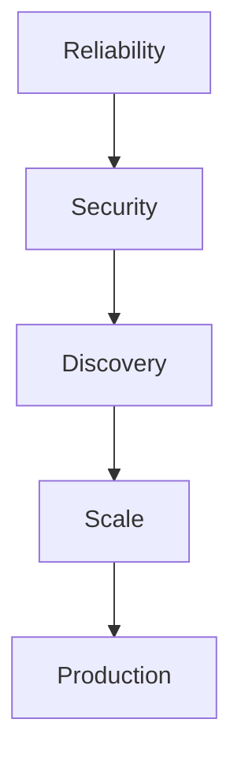
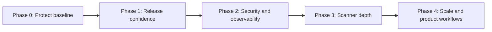

# ECDAT-SIH Improvement Roadmap

> Reviewed 2026-09-10. For implementation status and current verification, see [IMPLEMENTATION.md](IMPLEMENTATION.md) and [verification-2026-09-10.md](verification-2026-09-10.md).

**Updated:** 2026-09-09

**Branch:** `fix/sha1-recommendation`

**Verified baseline:** backend 118 passed / 1 skipped; frontend 22 passed; seven Chromium E2E scenarios passed; TypeScript production build and Prettier check passed; live API ready and dashboard HTTP 200.

## Current position

ECDAT already has a working FastAPI API, signed session authentication, role-based access, audit records, supervised child-process scans, cancellation and timeout handling, discovery metrics, CBOM/risk outputs, and a responsive React dashboard. The recovered frontend is functional but remains uncommitted, so stabilizing and protecting that baseline comes before adding features.

The previous plan overstated several gaps. Scan work is already moved out of the request path, pipeline failures are tested, database connections already use `pool_pre_ping`, and risk/CSV exports already exist. The roadmap below focuses on verified gaps.

## Delivery sequence

## Phase 0 — Protect the recovered baseline

**Goal:** Make the current known-good state reproducible before new development.

1. Review and commit the recovered frontend as one focused commit.
2. Commit the new logo, extracted form controls, cleanup utility, and regression tests.
3. Record the recovery source and remove the temporary safety stash only after the commit is verified.
4. Add `.gitattributes` end-of-line rules so Windows formatting does not create misleading dirty files.

**Acceptance criteria**

- A fresh clone passes backend tests, frontend tests, format check, production build, and E2E tests.
- `git status` is clean after running all checks.
- No recovered file remains untracked.

**Effort:** 0.5 day. **Priority:** P0.

## Phase 1 — Make CI match local verification

**Goal:** Prevent a regression from reaching the branch.

1. Replace `python -m unittest discover` in CI with `pytest`; the current command misses pytest-only tests.
2. Add `npm test` to CI; today CI checks formatting and compilation but not React unit tests.
3. Add a Playwright Chromium job with browser caching and uploaded failure traces.
4. Add coverage reporting and initially enforce realistic floors: backend 80%, frontend 70%; increase from measured data.
5. Add lightweight static checks: Ruff for Python and ESLint for TypeScript/React.

**Acceptance criteria**

- CI runs the same 118 backend tests, 22 frontend tests, and seven E2E scenarios verified locally.
- Pull requests cannot merge when tests, formatting, build, lint, or coverage gates fail.
- Failure artifacts include Playwright traces and coverage reports.

**Effort:** 1–2 days. **Priority:** P0.

## Phase 2 — Security and operational visibility

**Goal:** Make failures traceable and protect expensive entry points.

1. Add request IDs, return `X-Request-ID`, and include the ID in audit records and logs.
2. Replace `print`-based application logging with standard structured JSON logging; redact repository paths and secrets.
3. Apply endpoint-aware limits: strict login throttling, scan submission quotas, and no limit on health probes.
4. Move security headers from the HTML meta tag to deployment/server headers and tighten CSP without `unsafe-inline` where feasible.
5. Centralize validated environment settings in one configuration module and document production-safe defaults.
6. Integrate the stale-scan cleanup utility into startup or scheduled operations, with a dry-run mode and audit event.

**Acceptance criteria**

- One request ID follows an API call through response headers, structured logs, and audit history.
- Repeated login and scan abuse receives deterministic `429` responses with `Retry-After`.
- Logs contain no bearer tokens, passwords, raw evidence, or unrestricted local paths.
- Restarting after an interrupted scan leaves no permanently queued/running job.

**Effort:** 3–5 days. **Priority:** P1.

## Phase 3 — Improve discovery assurance

**Goal:** Increase measurable recall without sacrificing explainability or precision.

1. Expand ground-truth fixtures before adding detectors: more Java APIs, Python aliases, certificates, TLS configuration, dependency manifests, and negative examples.
2. Add property-based tests for path handling, correlation identity, key sizes, and evidence redaction.
3. Extend dependency parsing to lockfiles and resolved versions, preserving evidence provenance.
4. Add certificate posture fields such as expiry, signature algorithm, key strength, and trust role.
5. Version detector rules and correlation logic in exported evidence so results remain reproducible.
6. Benchmark large repositories and set explicit time, memory, file-count, precision, and recall budgets.

**Acceptance criteria**

- Every new detector starts with positive, negative, conflict, and malformed-input fixtures.
- Evaluation reports precision/recall by collector and language, not only aggregate values.
- Performance regressions beyond the agreed budget fail CI.
- Findings always retain source location, collector, confidence reasons, and rule/correlation version.

**Effort:** 1–2 weeks, incremental. **Priority:** P1.

## Phase 4 — Scale and complete product workflows

**Goal:** Move from a strong single-node prototype toward multi-user operation.

1. Replace the process-local single-scan admission flag with a persistent queue and worker lease model.
2. Add server-sent events for scan progress; use WebSockets only if bidirectional control becomes necessary.
3. Add dashboard views for audit history, stale/failed scan recovery, and collector-level coverage.
4. Add downloadable CBOM JSON plus CycloneDX-compatible export validation; retain CSV and risk text exports.
5. Profile real database queries before introducing async SQLAlchemy or caching; optimize only measured bottlenecks.
6. Introduce `/api/v1` with a compatibility window rather than breaking existing `/api` clients.

**Acceptance criteria**

- Multiple API instances cannot claim the same scan, and abandoned leases are recoverable.
- Progress updates reconnect cleanly and polling remains as a fallback.
- Exported CBOM passes a published schema validator.
- API versioning includes migration notes and contract tests.

**Effort:** 2–4 weeks. **Priority:** P2.

## Recommended next three work items

| Order | Work item | Why now | Definition of done |
|---:|---|---|---|
| 1 | Baseline recovery commit | Current frontend is verified but still vulnerable to another reset | Clean status, tagged recovery commit, safety stash retained until verification |
| 2 | CI parity | Existing CI omits frontend unit tests, E2E, and pytest-only cases | Local and CI check matrices are identical |
| 3 | Request IDs + structured logging | Gives evidence for every later security and reliability change | Correlated, redacted JSON logs covered by tests |

## Explicitly deferred

- **Async database migration:** only after profiling shows synchronous DB calls are the bottleneck.
- **Response caching:** only after correctness, invalidation rules, and query measurements are defined.
- **Auth middleware rewrite:** dependency injection is currently explicit and testable; change it only for a measured need.
- **User-management UI and refresh tokens:** valuable for a hosted multi-user product, but premature for the current environment-provisioned prototype.
