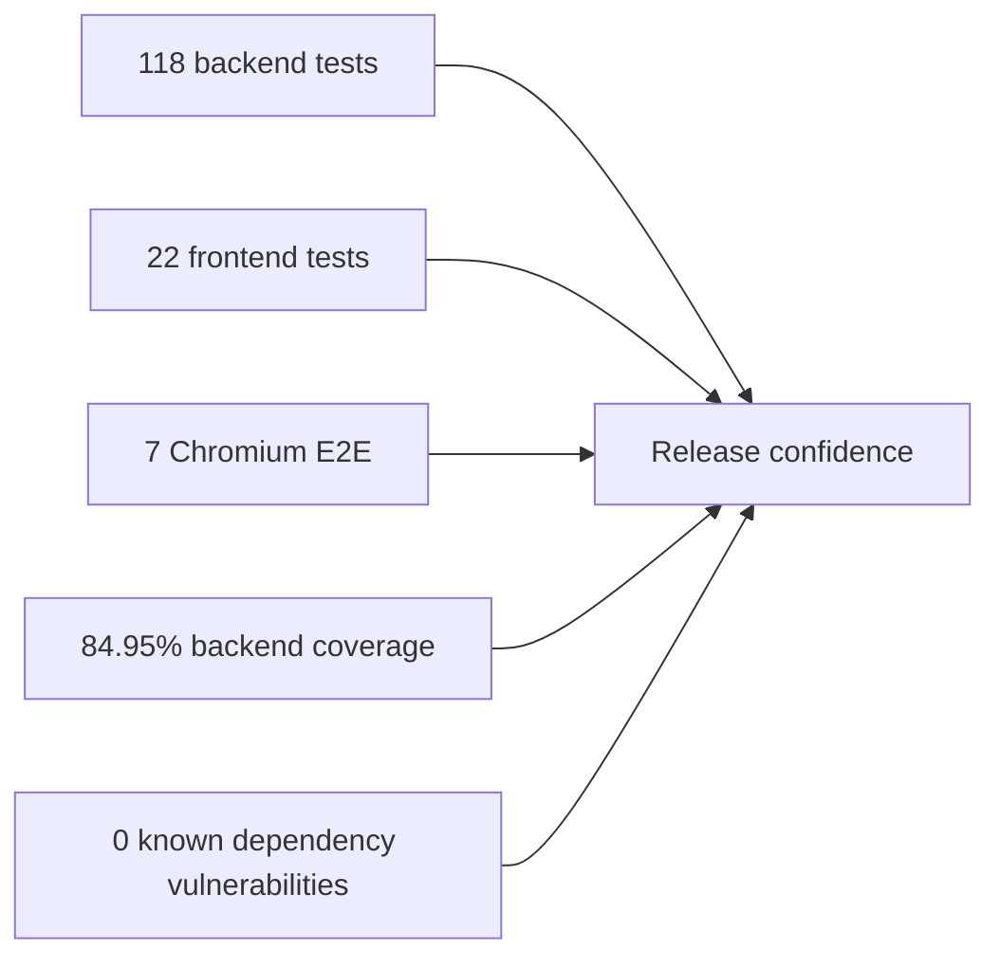

# ECDAT verification report — 2026-09-10

## Verdict

The current local implementation passed its backend, frontend, browser, coverage, lint, build and dependency checks. This evidence reduces known regression risk; it does not prove the absence of every bug or establish production certification.

## Executed evidence

| Check | Result |
|---|---|
| Pytest | 118 passed, 1 skipped, 84 subtests |
| Backend coverage | 84.95%; 70% floor satisfied |
| Ruff | Passed |
| Frontend unit tests | 22 passed across 8 files |
| Prettier | Passed |
| TypeScript and Vite build | Passed |
| Playwright Chromium | 7 passed |
| npm audit | 0 vulnerabilities |
| pip-audit | No known vulnerabilities |
| Bandit | No medium/high findings; eight low-severity review items |
| Live smoke test | `/health` OK, `/ready` ready, dashboard HTTP 200 |

## Repairs included

- Restored Windows scanner compatibility and zero-valued optional budgets.
- Corrected request-ID middleware and async-safe request context handling.
- Corrected rate-limit identity behavior and endpoint compatibility.
- Restored scanner-runner completion and persisted failures.
- Added migration-backed scan leases, stale recovery and authenticated SSE progress.
- Repaired frontend stream authentication, cleanup, TypeScript build and CI dependency locks.

## Residual work

- Remove the remaining frontend lint warnings before making warnings fatal.
- Add production SSO, TLS termination, managed secrets, shared rate limiting and a durable external queue.
- Add independent security review and broader unconsumed accuracy corpora.
